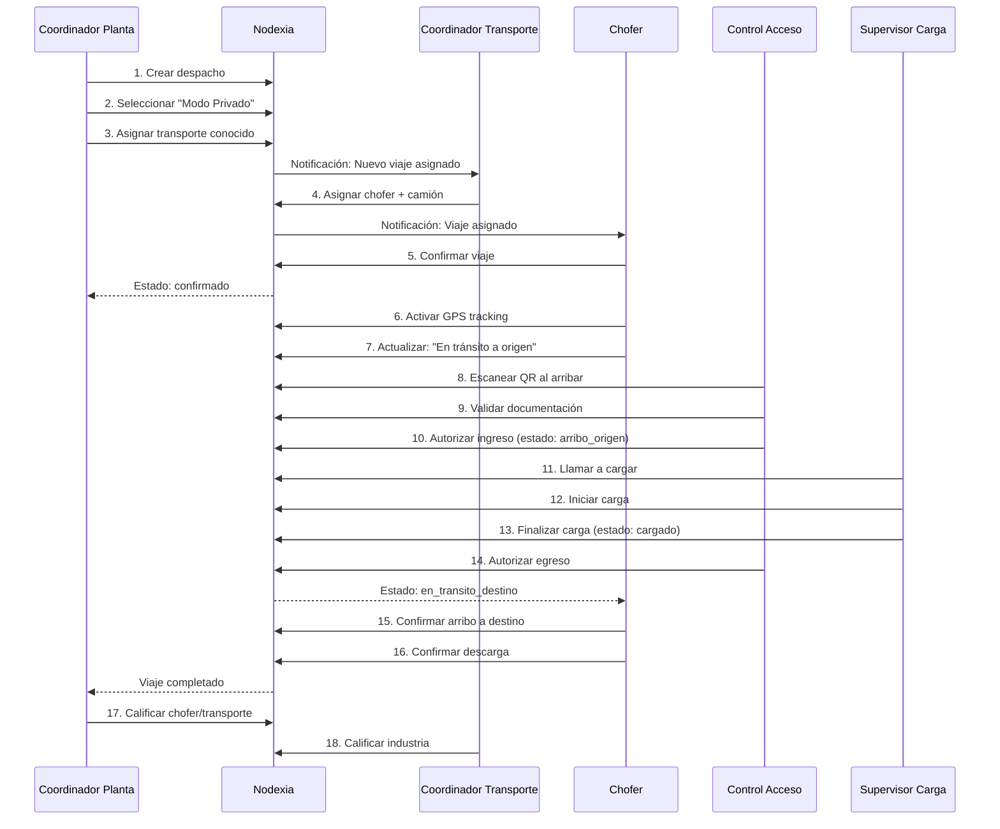
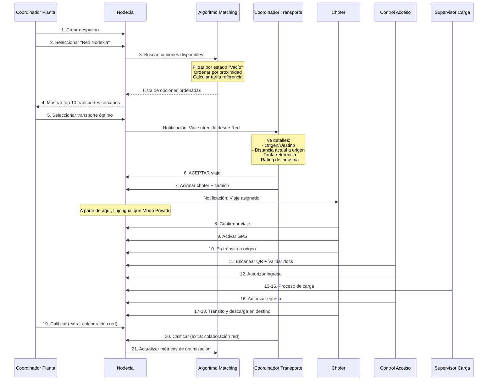

# 🌟 NODEXIA - Visión Completa del Proyecto

**Fecha de última actualización**: 30 de Noviembre de 2025  
**Versión**: 2.0  
**Estado**: En desarrollo - Testing de flujo operativo

---

## 📖 Índice

1. [Visión y Propósito](#visión-y-propósito)
2. [Problema que Resuelve](#problema-que-resuelve)
3. [La Solución Nodexia](#la-solución-nodexia)
4. [Modelo de Operación Dual](#modelo-de-operación-dual)
5. [Ecosistema de Actores](#ecosistema-de-actores)
6. [Flujos Operativos Completos](#flujos-operativos-completos)
7. [Estados Duales del Sistema](#estados-duales-del-sistema)
8. [Red Colaborativa Nodexia](#red-colaborativa-nodexia)
9. [Algoritmo de Matching Inteligente](#algoritmo-de-matching-inteligente)
10. [Sistema de Calificaciones](#sistema-de-calificaciones)
11. [Modelo de Negocio](#modelo-de-negocio)
12. [Arquitectura Técnica](#arquitectura-técnica)
13. [Métricas de Impacto](#métricas-de-impacto)
14. [Roadmap de Implementación](#roadmap-de-implementación)

---

## 🎯 Visión y Propósito

### **¿Qué es Nodexia?**

**Nodexia es una plataforma SaaS B2B de gestión logística colaborativa** que conecta industrias con transportes de carga para optimizar rutas, reducir trayectos vacíos y democratizar el acceso a servicios logísticos.

### **Misión**

Crear un **ecosistema colaborativo sin intermediarios ni comisiones** donde:
- Grandes industrias accedan a pequeños transportes
- Pequeñas industrias accedan a grandes transportes
- Camiones optimicen rutas evitando volver vacíos
- Se reduzca la huella de carbono del transporte de carga
- Todos tengan las mismas oportunidades basadas en optimización, no en poder de negociación

### **Diferenciador Clave**

> **"Nodexia NO es un marketplace de competencia. Es una RED de colaboración."**

**Lo que NO somos:**
- ❌ No somos una plataforma de subastas
- ❌ No cobramos comisiones por viaje
- ❌ No generamos competencia de precios
- ❌ No somos intermediarios

**Lo que SÍ somos:**
- ✅ Plataforma SaaS de suscripción mensual
- ✅ Red colaborativa de optimización logística
- ✅ Herramienta de gestión integral
- ✅ Espacio de encuentro directo sin intermediarios
- ✅ Sistema de matching inteligente por proximidad

---

## 🔴 Problema que Resuelve

### **1. Ineficiencia Logística**
- Camiones regresan vacíos después de descargar (40-60% de trayectos vacíos en Argentina)
- Rutas mal optimizadas generan costos innecesarios
- Falta de visibilidad de unidades disponibles

### **2. Falta de Acceso Equitativo**
- **Industrias pequeñas** no acceden a transportes confiables de gran porte
- **Transportes pequeños** no acceden a cargas de grandes industrias
- Relaciones comerciales cerradas dificultan el crecimiento

### **3. Intermediarios y Comisiones**
- Plataformas actuales cobran 5-15% de comisión por viaje
- Comisionistas agregan costos sin valor agregado
- Falta de transparencia en tarifas

### **4. Impacto Ambiental**
- Trayectos vacíos aumentan emisiones de CO2
- Rutas no optimizadas generan contaminación innecesaria

### **5. Falta de Herramientas de Gestión**
- Empresas usan Excel, WhatsApp y llamadas telefónicas
- No hay trazabilidad en tiempo real
- Documentación en papel
- Falta de métricas y datos

---

## 💡 La Solución Nodexia

### **Plataforma Integral que ofrece:**

#### **1. Gestión Operativa Completa**
- Crear y administrar despachos
- Planificación semanal/mensual con drag & drop
- Asignación de recursos (choferes, camiones)
- Control de estados duales (unidad + carga)
- Validación de documentación
- Seguimiento GPS en tiempo real

#### **2. Red Colaborativa Inteligente**
- Matching automático por proximidad geográfica
- Acceso a pool de transportes disponibles
- Notificaciones de cargas cercanas
- Sistema de calificaciones cruzadas
- Historial de colaboraciones exitosas

#### **3. Optimización Basada en Datos**
- Algoritmo de matching por estados de unidad ("vacío")
- Cálculo de tarifas de referencia (no negociables)
- Métricas de km vacíos evitados
- Dashboard de impacto ambiental (CO2 ahorrado)
- Analytics avanzados

#### **4. Sin Intermediarios**
- Conexión directa industria ↔ transporte
- Tarifa transparente basada en referencias oficiales
- Sin comisiones por viaje
- Modelo SaaS de suscripción mensual

---

## 🔄 Modelo de Operación Dual

Nodexia ofrece **DOS modos de operación** que conviven en la misma plataforma:

### **Modo 1: Operación Privada** ✅ (Ya implementado 90%)

**¿Cuándo se usa?**
- Industria trabaja con sus transportes habituales de siempre
- Relaciones comerciales establecidas y confiables
- No necesita buscar nuevos proveedores

**¿Cómo funciona?**
```
Coordinador Planta → Crea despacho
                   → Selecciona su transporte conocido
                   → Asigna viaje manualmente
                   → Flujo normal de gestión
```

**Features disponibles:**
- Planificación y gestión de despachos
- Asignación manual de recursos
- GPS tracking en tiempo real
- Estados duales (unidad + carga)
- Control de acceso y documentación
- Historial y reportes

**Beneficio:**
Nodexia actúa como **herramienta de gestión interna** completa.

---

### **Modo 2: Red Nodexia (Colaborativa)** 🌐 (Por implementar)

**¿Cuándo se usa?**
- Industria necesita más opciones de transporte
- Quiere optimizar costos por proximidad
- Busca ampliar su red de proveedores
- Transporte busca cargas para no volver vacío

**¿Cómo funciona?**
```
Coordinador Planta → Crea despacho
                   → Selecciona "Red Nodexia"
                   → Algoritmo busca camiones cercanos en estado "Vacío"
                   → Muestra opciones ordenadas por proximidad
                   → Coordinador elige el más conveniente
                   → Notifica a Coordinador de Transporte elegido
                   → Transporte acepta/rechaza
                   → Si acepta → Se crea viaje
                   → Flujo normal de gestión
```

**Features adicionales:**
- Todo lo del Modo Privado +
- Matching inteligente por proximidad y estados
- Acceso a pool de transportes de la red
- Calificaciones cruzadas
- Métricas de colaboración
- Dashboard de impacto (CO2, km optimizados)

**Beneficio:**
Nodexia actúa como **espacio de encuentro colaborativo** sin intermediarios.

---

### **Comparativa de Modos:**

| Feature | Modo Privado | Red Nodexia |
|---------|--------------|-------------|
| Gestión de despachos | ✅ | ✅ |
| Planificación visual | ✅ | ✅ |
| Asignación manual | ✅ | ❌ |
| Matching por algoritmo | ❌ | ✅ |
| Búsqueda por estado "Vacío" | ❌ | ✅ |
| Pool de transportes disponibles | ❌ | ✅ |
| Tarifa de referencia automática | ❌ | ✅ |
| GPS tracking | ✅ | ✅ |
| Estados duales | ✅ | ✅ |
| Calificaciones cruzadas | Básicas | Avanzadas |
| Métricas de impacto ambiental | ❌ | ✅ |
| Historial de colaboraciones | ✅ | ✅ |

---

## 👥 Ecosistema de Actores

### **1. Industrias (Demanda de transporte)**

**Roles dentro de la industria:**

#### **Coordinador de Planta** (Rol clave)
**Responsabilidades:**
- Crear despachos (definir origen, destino, producto, peso, fecha)
- **DECIDIR** modo de asignación: Privado o Red Nodexia
- En Modo Privado: Asignar transporte manualmente
- En Red Nodexia: Elegir entre opciones sugeridas por algoritmo
- Hacer seguimiento de viajes en planificación
- Ver tracking GPS en tiempo real

**Pantallas principales:**
- `/crear-despacho` (con selector de modo)
- `/planificacion` (vista semanal/mensual)
- `/transporte/viajes-activos` (seguimiento en tiempo real)

#### **Control de Acceso** (Seguridad)
**Responsabilidades:**
- Escanear QR de viaje al arribar camión
- Validar documentación de chofer y camión
- Autorizar ingreso a planta
- Registrar egreso después de carga
- Actualizar estado de unidad: `arribo_origen` → `en_transito_destino`

**Pantallas principales:**
- `/control-acceso`

#### **Supervisor de Carga** (Operaciones)
**Responsabilidades:**
- Ver camiones que ingresaron y están esperando carga
- Llamar a cargar (priorizar según urgencia)
- Iniciar proceso de carga
- Finalizar carga (confirmar peso, bultos)
- Actualizar estado de carga: `planificado` → `en_proceso_carga` → `cargado`

**Pantallas principales:**
- `/supervisor-carga` (dashboard de operaciones)

---

### **2. Transportes (Oferta de servicio)**

**Roles dentro del transporte:**

#### **Coordinador de Transporte** (Rol clave)
**Responsabilidades:**
- Recibir notificaciones de viajes ofrecidos desde Red Nodexia
- **ACEPTAR o RECHAZAR** viajes propuestos
- Asignar chofer y camión a viajes aceptados
- Gestionar disponibilidad de flota
- Ver estado de todas sus unidades en tiempo real
- Calificar industrias al finalizar viajes

**Pantallas principales:**
- Dashboard de viajes pendientes de aceptación
- `/gestionar-flota` (estado de camiones)
- `/viajes-activos` (seguimiento)

#### **Chofer** (Usuario móvil)
**Responsabilidades:**
- Ver viajes asignados
- Confirmar aceptación de viaje
- Activar GPS tracking al salir
- Actualizar estados operativos (confirmar arribo, salida, etc.)
- Subir fotos de documentación/carga
- Recibir notificaciones de ruta

**Pantallas principales:**
- `/chofer/mis-viajes` (lista de asignaciones)
- `/chofer/tracking-gps` (activar/desactivar GPS)

---

### **3. Integrantes de la Red Nodexia**

**Participan:**
- Industrias que publican cargas en Red Nodexia
- Transportes que buscan cargas cercanas
- Ambos pueden trabajar en Modo Privado + Red Nodexia

**Requisitos para participar en red:**
- Tener suscripción activa
- Rating mínimo de 3.5/5 estrellas
- Sin suspensiones por cancelaciones
- Documentación al día

---

## 🔄 Flujos Operativos Completos

### **FLUJO 1: Modo Privado (Asignación Directa)**



**Duración estimada**: 1-3 días (según distancia)

---

### **FLUJO 2: Red Nodexia (Matching Colaborativo)**



**Duración estimada**: 1-3 días + tiempo de aceptación (máx 24hs)

---

### **Diferencias clave entre flujos:**

| Paso | Modo Privado | Red Nodexia |
|------|--------------|-------------|
| Selección transporte | Manual por CP | Sugerido por algoritmo |
| Notificación | Directa | Invitación con datos |
| Aceptación | Implícita | Explícita (acepta/rechaza) |
| Tarifa | Negociada previamente | Referencia automática |
| Calificación | Básica | + Métricas de colaboración |
| Seguimiento post-viaje | Estándar | + Impacto ambiental |

---

## 🎛️ Estados Duales del Sistema

**Concepto clave**: Nodexia usa un **sistema de estados dual** para gestionar operaciones:

### **Estado de Unidad (Camión/Chofer)**
Controla la **ubicación y disponibilidad** del camión.

### **Estado de Carga (Producto/Mercadería)**
Controla el **proceso operativo** de carga/descarga.

---

### **Estados de Unidad (10 estados)**

| Estado | Descripción | Quién lo actualiza | Cuándo |
|--------|-------------|-------------------|--------|
| `pendiente` | Viaje creado, sin asignar | Sistema | Al crear despacho |
| `asignado` | Transporte asignado | Coordinador Planta/Transporte | Al asignar recursos |
| `confirmado` | Chofer aceptó viaje | Chofer | Desde app móvil |
| `en_transito_origen` | Camión yendo a cargar | Chofer | Al salir hacia origen |
| `arribo_origen` | Camión llegó a planta | Control de Acceso | Al escanear QR ingreso |
| `en_transito_destino` | Camión cargado, yendo a destino | Control de Acceso | Al escanear QR egreso |
| `arribo_destino` | Camión llegó a destino | Chofer/Control destino | Al llegar |
| `descargando` | En proceso de descarga | Supervisor Descarga | Al iniciar descarga |
| `vacio` | ⭐ Camión descargado, disponible | Sistema automático | Al finalizar descarga |
| `cancelado` | Viaje cancelado | Coordinador | Cualquier momento antes de carga |

#### **⭐ Estado "Vacío" - Clave para Red Nodexia**

**Importancia:**
- Es el estado que el **algoritmo de matching busca**
- Indica que el camión **está disponible para nueva carga**
- Incluye **ubicación GPS actual** del camión

**Flujo automático:**
```
Descarga finalizada → Estado = "vacío"
                   → Sistema registra ubicación GPS actual
                   → Camión aparece en búsquedas de Red Nodexia
                   → Ordenado por proximidad a nuevos orígenes
```

---

### **Estados de Carga (8 estados)**

| Estado | Descripción | Quién lo actualiza | Cuándo |
|--------|-------------|-------------------|--------|
| `planificado` | Despacho creado | Sistema | Al crear despacho |
| `documentacion_preparada` | Docs validadas | Control de Acceso | Al autorizar ingreso |
| `llamado_carga` | Supervisor llamó a cargar | Supervisor Carga | Al priorizar camión |
| `en_proceso_carga` | Cargando | Supervisor Carga | Al iniciar carga |
| `cargado` | Carga completa | Supervisor Carga | Al finalizar carga |
| `en_transito` | En camino a destino | Sistema | Al salir de origen |
| `descargado` | Descarga completa | Supervisor Descarga | Al finalizar descarga |
| `cancelado` | Carga cancelada | Coordinador | Antes de cargar |

---

### **Validación Cruzada de Estados**

El sistema **valida que los estados sean coherentes**:

#### **Reglas de validación:**

```typescript
// NO permitir estado_carga = "cargado" si estado_unidad ≠ "arribo_origen"
// NO permitir estado_unidad = "en_transito_destino" si estado_carga ≠ "cargado"
// NO permitir estado_carga = "descargado" si estado_unidad ≠ "arribo_destino"
```

#### **Transiciones automáticas:**

```
Control Acceso autoriza egreso → estado_unidad = "en_transito_destino"
                               → estado_carga = "en_transito" (auto)

Supervisor finaliza carga → estado_carga = "cargado"
                          → Habilita botón "Autorizar egreso" en Control Acceso
```

---

## 🌐 Red Colaborativa Nodexia

### **¿Cómo funciona la red?**

#### **Para Industrias:**
1. Crea despacho normalmente
2. Al asignar viaje, elige **"Red Nodexia"**
3. Sistema muestra lista de transportes con camiones en estado **"Vacío"**
4. Ve información de cada opción:
   - Distancia actual a punto de carga
   - Capacidad del camión
   - Rating del transporte (1-5 ⭐)
   - Tarifa de referencia calculada
   - Tiempo estimado de disponibilidad
5. Selecciona el transporte óptimo
6. Sistema notifica al Coordinador de Transporte elegido
7. Espera aceptación (máx 24hs)
8. Si acepta → viaje asignado, flujo normal
9. Si rechaza → puede elegir otro transporte

#### **Para Transportes:**
1. Sus camiones terminan viaje y quedan en estado **"Vacío"**
2. Sistema detecta ubicación GPS actual
3. Cuando industria busca en Red Nodexia, sus camiones aparecen si están cerca
4. Coordinador de Transporte recibe notificación:
   ```
   📢 Carga disponible cerca
   
   Origen: Rosario (45 km de tu camión actual)
   Destino: Buenos Aires
   Producto: Harina 25 toneladas
   Fecha: Mañana 08:00hs
   Tarifa referencia: $XXX
   
   Industria: Tecnoembalajes (Rating: 4.8⭐)
   
   [Aceptar] [Rechazar]
   ```
5. Decide aceptar o rechazar según:
   - Proximidad a su camión
   - Compatibilidad con su operativa
   - Rating de la industria
   - Tarifa justa según referencia
6. Si acepta → asigna chofer/camión → flujo normal

---

### **Visibilidad en la Red**

#### **Camión aparece en búsquedas cuando:**
- ✅ Estado de unidad = "vacío"
- ✅ Tiene ubicación GPS reciente (< 1 hora)
- ✅ Capacidad compatible con carga
- ✅ Transporte con rating > 3.5⭐
- ✅ Sin suspensiones activas
- ✅ Documentación al día

#### **Camión NO aparece cuando:**
- ❌ Estado ≠ "vacío"
- ❌ Sin GPS activo
- ❌ Suspendido por cancelaciones
- ❌ Rating < 3.5⭐

---

## 🧠 Algoritmo de Matching Inteligente

### **Objetivo:**
Encontrar el transporte **más eficiente** (no el más barato) para cada carga.

### **Variables de entrada:**

```typescript
interface BusquedaTransporte {
  // Datos del despacho
  origen: { lat: number; lng: number; direccion: string };
  destino: { lat: number; lng: number; direccion: string };
  peso_toneladas: number;
  volumen_m3: number;
  tipo_carga: 'general' | 'refrigerada' | 'peligrosa' | 'fragil';
  fecha_requerida: Date;
  
  // Contexto
  urgente: boolean; // < 48hs
  zona_remota: boolean;
}
```

### **Proceso del algoritmo:**

```typescript
// Paso 1: Filtrar camiones disponibles
const camionesDisponibles = await buscarCamiones({
  estado: 'vacio',
  capacidad_minima: peso_toneladas,
  tipo_compatible: tipo_carga,
  fecha_disponible: fecha_requerida
});

// Paso 2: Calcular distancia de cada camión al origen
camionesDisponibles.forEach(camion => {
  camion.distancia_km = calcularDistanciaHaversine(
    camion.ubicacion_gps,
    despacho.origen
  );
});

// Paso 3: Calcular tarifa de referencia
const tarifaBase = getTarifaReferenciaOficial({
  distancia_km: calcularDistancia(origen, destino),
  peso_toneladas,
  tipo_carga
});

// Ajustes contextuales
let tarifa = tarifaBase;
if (urgente) tarifa *= 1.10; // +10%
if (zona_remota) tarifa *= 1.15; // +15%
if (tipo_carga === 'refrigerada') tarifa *= 1.20; // +20%

// Paso 4: Calcular score de optimización
camionesDisponibles.forEach(camion => {
  let score = 100;
  
  // Proximidad (factor más importante)
  if (camion.distancia_km <= 50) score += 50;
  else if (camion.distancia_km <= 100) score += 30;
  else if (camion.distancia_km <= 200) score += 10;
  else score -= 20;
  
  // Rating del transporte
  score += (camion.transporte_rating - 3) * 10; // 4⭐ = +10, 5⭐ = +20
  
  // Frecuencia de colaboración
  if (camion.viajes_previos_con_industria > 0) score += 15;
  
  // Coincidencia de ruta (destino cerca de próxima carga del transporte)
  if (camion.tiene_ruta_regreso_cerca) score += 25;
  
  camion.score_optimizacion = score;
});

// Paso 5: Ordenar por score
camionesDisponibles.sort((a, b) => b.score_optimizacion - a.score_optimizacion);

// Paso 6: Devolver top 10
return camionesDisponibles.slice(0, 10);
```

---

### **Criterios de ordenamiento:**

| Criterio | Peso | Justificación |
|----------|------|---------------|
| **Proximidad al origen** | 50% | Reduce km vacíos, menor costo operativo |
| **Rating del transporte** | 20% | Confiabilidad y calidad del servicio |
| **Capacidad adecuada** | 15% | Ni sobredimensionado ni insuficiente |
| **Frecuencia previa** | 10% | Colaboraciones exitosas previas |
| **Coincidencia de ruta** | 5% | Optimización de viaje de regreso |

---

### **Cálculo de Tarifa de Referencia**

**Fuentes oficiales (Argentina):**
- FADEEAC (Federación Argentina de Entidades Empresarias del Autotransporte de Cargas)
- CAFT (Cámara Argentina de Fletes y Transporte)
- Resoluciones de Secretaría de Transporte

**Fórmula base:**
```typescript
tarifa_referencia = (distancia_km * tarifa_por_km) + 
                   (peso_toneladas * tarifa_por_tonelada) +
                   (ajuste_por_tipo_carga) +
                   (ajuste_por_contexto)
```

**Ejemplo real:**
```
Rosario → Buenos Aires
Distancia: 300 km
Peso: 25 toneladas
Tipo: General

Tarifa base: 300km × $500/km = $150,000
Por peso: 25t × $1,000/t = $25,000
Tipo general: $0
Urgente (NO): $0
Zona remota (NO): $0

TARIFA FINAL: $175,000 (no negociable)
```

---

### **Punto crucial de definición:**

```
⚠️ PENDIENTE DE DEFINIR:
Fuente de tarifas oficiales para automatización

Opciones:
A) API de FADEEAC/CAFT (si existe)
B) Web scraping de tablas públicas
C) Carga manual en Nodexia + actualización mensual
D) Integración con proveedor de datos logísticos

DECISIÓN PENDIENTE - Prioridad Alta
```

---

## ⭐ Sistema de Calificaciones

### **Objetivo:**
Crear un ecosistema de confianza basado en transparencia y rendición de cuentas.

### **¿Quién califica a quién?**

#### **Calificaciones Cruzadas:**

```
Coordinador Planta ←→ Coordinador Transporte
        ↓                      ↓
    Industria              Transporte
                 ↓
              Chofer
```

---

### **1. Industria califica a Transporte**

**Aspectos evaluados** (1-5 ⭐):
- **Puntualidad**: ¿Arribó en horario pactado?
- **Estado del camión**: ¿Limpio y en condiciones?
- **Documentación**: ¿Papeles completos y al día?
- **Comunicación**: ¿Respondió consultas ágilmente?
- **Calidad del servicio**: Experiencia general

**Cuándo:** Al finalizar viaje (estado = descargado)

**Impacto:**
- Rating promedio del transporte visible en Red Nodexia
- Transportes con rating < 3.5 no aparecen en búsquedas
- Rating alto = prioridad en futuras colaboraciones

---

### **2. Transporte califica a Industria**

**Aspectos evaluados** (1-5 ⭐):
- **Condiciones de carga**: ¿Planta organizada?
- **Tiempo de espera**: ¿Cargaron en tiempo razonable?
- **Trato al chofer**: ¿Amabilidad, respeto?
- **Claridad de instrucciones**: ¿Info precisa de carga?
- **Pago puntual**: ¿Cumplió con condiciones de pago?

**Cuándo:** Al finalizar viaje

**Impacto:**
- Rating promedio de la industria visible para transportes
- Industrias con rating bajo pueden tener menos aceptación en Red
- Feedback para mejorar procesos operativos

---

### **3. Industria/Transporte califican a Chofer**

**Aspectos evaluados** (1-5 ⭐):
- **Conducción**: ¿Manejo seguro y cuidadoso?
- **Comunicación**: ¿Reportó novedades?
- **Puntualidad**: ¿Cumplió horarios?
- **Trato**: ¿Profesional y respetuoso?
- **Estado de la carga**: ¿Llegó en condiciones?

**Cuándo:** Al finalizar viaje

**Impacto:**
- Historial personal del chofer
- Transportes pueden tomar decisiones de asignación
- Incentivo para buen desempeño

---

### **Visualización de Ratings:**

#### **En perfil de Transporte:**
```
Logística Express SRL
⭐⭐⭐⭐⭐ 4.8 (127 viajes)

Detalle:
Puntualidad:     ⭐⭐⭐⭐⭐ 4.9
Estado camión:   ⭐⭐⭐⭐⭐ 4.7
Documentación:   ⭐⭐⭐⭐⭐ 5.0
Comunicación:    ⭐⭐⭐⭐☆ 4.5
Calidad servicio: ⭐⭐⭐⭐⭐ 4.8

Últimos comentarios:
"Excelente servicio, siempre puntuales" - Tecnoembalajes
"Camión impecable, chofer profesional" - Molino Santa Rosa
```

---

### **Prevención de Abusos:**

#### **Reglas:**
- ✅ Solo puede calificar quien completó viaje
- ✅ Calificación obligatoria para ambas partes
- ✅ Comentarios moderados (sin insultos)
- ✅ No se puede editar calificación después de 48hs
- ✅ Sistema detecta patrones de calificaciones maliciosas

#### **Penalizaciones:**
- Calificaciones injustas repetidas → advertencia
- Abuso demostrado → suspensión temporal
- Calificaciones mutuamente bajas → mediación de Nodexia

---

## 💰 Modelo de Negocio

### **Filosofía:**
> **"Eliminamos intermediarios y comisiones. Nodexia es SaaS puro."**

---

### **Competencia actual (a eliminar):**

| Plataforma | Modelo | Costo |
|------------|--------|-------|
| Cargapp | Comisión por viaje | 5-10% del valor |
| Pickit | Comisión dual | 3-7% c/u |
| Sirena | Comisión + suscripción | 5% + $XX/mes |

**Problema:** Intermediarios encarecen sin agregar valor real.

---

### **Modelo Nodexia:**

#### **Suscripción Mensual SaaS**

```
┌─────────────────────────────────────┐
│  PLAN INDUSTRIA                     │
├─────────────────────────────────────┤
│  $X.XXX / mes                       │
│                                     │
│  ✅ Modo Privado ilimitado          │
│  ✅ Modo Red Nodexia ilimitado      │
│  ✅ Usuarios ilimitados             │
│  ✅ GPS tracking en tiempo real     │
│  ✅ Gestión completa de despachos   │
│  ✅ Planificación visual            │
│  ✅ Estados duales                  │
│  ✅ Control de acceso               │
│  ✅ Validación documentación        │
│  ✅ Reportes y analytics            │
│  ✅ Soporte prioritario             │
│                                     │
│  🚀 Sin comisiones por viaje        │
│  🚀 Sin límite de despachos         │
└─────────────────────────────────────┘

┌─────────────────────────────────────┐
│  PLAN TRANSPORTE                    │
├─────────────────────────────────────┤
│  $Y.YYY / mes                       │
│                                     │
│  ✅ Gestión de flota completa       │
│  ✅ GPS en todos los camiones       │
│  ✅ Acceso a Red Nodexia            │
│  ✅ Notificaciones de cargas cerca  │
│  ✅ Dashboard de disponibilidad     │
│  ✅ Choferes ilimitados             │
│  ✅ Camiones ilimitados             │
│  ✅ Reportes de performance         │
│  ✅ Sistema de calificaciones       │
│  ✅ Soporte prioritario             │
│                                     │
│  🚀 Sin comisiones por viaje        │
│  🚀 Sin límite de cargas            │
└─────────────────────────────────────┘
```

---

### **Ventajas del modelo SaaS:**

#### **Para Industrias:**
- 💰 **Previsibilidad de costos**: Saben cuánto pagan cada mes
- 🚀 **Uso ilimitado**: Todos los despachos que necesiten
- 🤝 **Sin intermediarios**: Conexión directa con transportes
- 📊 **Herramientas incluidas**: No pagan por módulos extra

#### **Para Transportes:**
- 💰 **No pagan comisión por cada viaje**: Más rentabilidad
- 🌐 **Acceso a red de industrias**: Nuevos clientes sin costo extra
- 🚛 **Optimizan flota**: Reducen trayectos vacíos
- ⭐ **Reputación visible**: Rating les da ventaja competitiva

#### **Para Nodexia:**
- 📈 **Ingresos recurrentes predecibles**: MRR (Monthly Recurring Revenue)
- 🔄 **Escalabilidad**: Más usuarios = más ingresos, sin costos variables
- 🎯 **Alineación de incentivos**: Éxito de clientes = renovaciones
- 🌱 **Crecimiento de red**: Efecto viral (más industrias = más transportes)

---

### **Cálculo de valor (Pitch):**

#### **Ejemplo Industria:**
```
Situación actual (con intermediarios):
- 20 viajes/mes
- Valor promedio: $200,000
- Comisión 7%: $14,000/viaje
- Costo total comisiones: $280,000/mes

Con Nodexia:
- Suscripción: $50,000/mes
- Ahorro: $230,000/mes ($2,760,000/año)
- ROI: 460%
```

#### **Ejemplo Transporte:**
```
Situación actual (con comisiones):
- 30 viajes/mes
- Valor promedio cobrado: $180,000
- Comisión 5%: $9,000/viaje
- Pérdida por comisiones: $270,000/mes

Con Nodexia:
- Suscripción: $40,000/mes
- Ahorro: $230,000/mes ($2,760,000/año)
- ROI: 575%
- PLUS: Acceso a cargas de Red sin costo extra
```

---

### **Pricing estratégico (sugerido):**

```
FASE 1 (Primeros 6 meses - Adopción):
- Industrias: $30,000/mes
- Transportes: $25,000/mes
- Descuento 30% por pago anual

FASE 2 (Crecimiento):
- Industrias: $50,000/mes
- Transportes: $40,000/mes
- Descuento 20% por pago anual

FASE 3 (Madurez):
- Industrias: $80,000/mes
- Transportes: $60,000/mes
- Descuento 15% por pago anual
```

---

### **Métricas clave del negocio:**

```
🎯 MRR (Monthly Recurring Revenue)
🎯 Churn rate (cancelaciones)
🎯 LTV (Lifetime Value)
🎯 CAC (Customer Acquisition Cost)
🎯 Viajes totales en plataforma
🎯 % Viajes en Red Nodexia vs Privado
🎯 NPS (Net Promoter Score)
```

---

## 🏗️ Arquitectura Técnica

### **Stack Tecnológico:**

```typescript
// Frontend
- Framework: Next.js 15.5.6 (Pages Router)
- UI Library: React 19
- Language: TypeScript
- Styling: Tailwind CSS
- Components: Headless UI, Heroicons
- Maps: Leaflet.js + OpenStreetMap
- PWA: next-pwa

// Backend
- API: Next.js API Routes
- Database: Supabase PostgreSQL
- Auth: Supabase Auth (@supabase/auth-helpers-nextjs)
- Realtime: Supabase Realtime subscriptions
- Storage: Supabase Storage (documentos, fotos)

// Geolocalización
- GPS: Geolocation API del navegador
- Mapas: Leaflet + react-leaflet
- Tiles: OpenStreetMap
- Rutas: (Pendiente: Google Maps Directions API)

// Hosting & Deploy
- Frontend: Vercel
- Database: Supabase Cloud
- CDN: Vercel Edge Network
```

---

### **Esquema de Base de Datos (Tablas Principales):**

#### **Empresas y Usuarios:**
```sql
- empresas (id, nombre, cuit, direccion, ...)
- transportes (id, nombre, cuit, flota_tamano, ...)
- usuarios (auth.users de Supabase)
- choferes (id, nombre, email, telefono, id_empresa, user_id, ...)
- camiones (id, patente, marca, modelo, capacidad_kg, id_empresa, ...)
```

#### **Operaciones:**
```sql
- despachos (id, pedido_id, origen, destino, peso_kg, fecha_deseada, id_empresa, modo_operacion, ...)
- viajes_despacho (id, numero_viaje, despacho_id, id_transporte, id_chofer, id_camion, ...)
- estado_unidad_viaje (viaje_id, estado_unidad, fecha_cambio, ...)
- estado_carga_viaje (viaje_id, estado_carga, fecha_planificado, fecha_cargado, ...)
```

#### **GPS y Tracking:**
```sql
- ubicaciones_choferes (id, viaje_id, chofer_id, latitude, longitude, velocidad, heading, timestamp, ...)
```

#### **Control y Acceso:**
```sql
- registros_acceso (id, viaje_id, tipo, timestamp, usuario_id, observaciones, ...)
```

#### **Red Nodexia (Nuevas - Por implementar):**
```sql
- invitaciones_red (id, despacho_id, transporte_id, estado, fecha_expiracion, ...)
- calificaciones (id, viaje_id, calificador_id, calificado_id, tipo, estrellas, aspectos, comentario, ...)
- tarifas_referencia (id, origen_zona, destino_zona, distancia_km, peso_kg, tipo_carga, tarifa_base, ...)
- metricas_red (id, fecha, km_vacios_evitados, co2_ahorrado, viajes_red, viajes_privados, ...)
```

---

### **RLS (Row Level Security):**

Supabase RLS asegura que cada actor solo vea sus datos:

```sql
-- Ejemplo: Choferes solo ven sus viajes
CREATE POLICY "choferes_ven_sus_viajes"
ON viajes_despacho
FOR SELECT
USING (id_chofer = auth.uid());

-- Coordinadores ven viajes de su empresa
CREATE POLICY "coordinadores_ven_viajes_empresa"
ON viajes_despacho
FOR SELECT
USING (
  id_empresa = (
    SELECT empresa_id 
    FROM usuarios_empresas 
    WHERE user_id = auth.uid()
  )
);
```

---

### **Realtime con Supabase:**

```typescript
// Suscripción a cambios de ubicación GPS
const canal = supabase
  .channel(`viaje_${viajeId}`)
  .on('postgres_changes', {
    event: 'INSERT',
    schema: 'public',
    table: 'ubicaciones_choferes',
    filter: `viaje_id=eq.${viajeId}`
  }, (payload) => {
    // Actualizar mapa en tiempo real
    actualizarMarkerEnMapa(payload.new);
  })
  .subscribe();
```

---

## 📊 Métricas de Impacto

### **Dashboard de Red Nodexia:**

#### **1. Métricas Operativas:**
```
📦 Total de despachos del mes: XXX
   ├─ Modo Privado: XXX (XX%)
   └─ Red Nodexia: XXX (XX%)

🚛 Camiones activos en red: XXX
   ├─ Estado "Vacío": XXX
   ├─ En viaje: XXX
   └─ En mantenimiento: XXX

🏭 Industrias activas: XXX
   ├─ Solo Modo Privado: XXX
   └─ Usan Red Nodexia: XXX

🚚 Transportes activos: XXX
   ├─ Pequeños (1-5 camiones): XXX
   ├─ Medianos (6-20): XXX
   └─ Grandes (+20): XXX
```

#### **2. Métricas de Optimización:**
```
🎯 Km vacíos evitados este mes: X,XXX km
   (vs promedio industria: -XX%)

🌱 CO2 ahorrado: X.X toneladas
   (equivalente a X árboles plantados)

⚡ Tiempo de respuesta promedio Red: X horas
   (desde publicación hasta aceptación)

✅ Tasa de aceptación: XX%
   (invitaciones aceptadas vs enviadas)

📈 Tasa de conversión Red: XX%
   (despachos que eligieron Red vs Privado)
```

#### **3. Métricas de Calidad:**
```
⭐ Rating promedio Transportes: X.X / 5
⭐ Rating promedio Industrias: X.X / 5
⭐ Rating promedio Choferes: X.X / 5

👍 NPS (Net Promoter Score): XX
🔄 Tasa de renovación: XX%
📉 Churn rate: X.X%
```

#### **4. Métricas de Colaboración:**
```
🤝 Colaboraciones exitosas (Red): XXX viajes
💪 Pequeñas industrias con acceso a grandes transportes: XX casos
🚀 Pequeños transportes con cargas de grandes industrias: XX casos

📊 Promedio de viajes por transporte/mes:
   - Antes de Red Nodexia: X viajes
   - Después de Red Nodexia: X viajes (+XX%)
```

---

### **Reportes Ejecutivos (Mensual):**

```
╔════════════════════════════════════════╗
║     REPORTE RED NODEXIA - NOV 2025    ║
╠════════════════════════════════════════╣
║  📈 Crecimiento                        ║
║  ├─ Nuevas industrias: +XX             ║
║  ├─ Nuevos transportes: +XX            ║
║  └─ Total actores: XXX                 ║
║                                        ║
║  🌐 Actividad Red                      ║
║  ├─ Viajes Red Nodexia: XXX (+XX%)     ║
║  ├─ Km optimizados: X,XXX km           ║
║  └─ CO2 ahorrado: X.X ton              ║
║                                        ║
║  💰 Salud del Negocio                  ║
║  ├─ MRR: $X,XXX,XXX                    ║
║  ├─ Churn: X.X%                        ║
║  └─ LTV/CAC: X.X                       ║
║                                        ║
║  ⭐ Satisfacción                        ║
║  ├─ NPS: XX                            ║
║  ├─ Rating promedio: X.X/5             ║
║  └─ Renovaciones: XX%                  ║
╚════════════════════════════════════════╝
```

---

## 🛣️ Roadmap de Implementación

### **FASE 1: Core Platform (Completado 90%)**
**Duración**: 2 meses ✅

- [x] Sistema de autenticación y roles
- [x] Gestión de empresas, transportes, choferes, camiones
- [x] Crear y gestionar despachos (Modo Privado)
- [x] Asignación manual de viajes
- [x] GPS tracking en tiempo real
- [x] Estados duales (unidad + carga)
- [x] Control de acceso con QR
- [x] Planificación semanal con drag & drop
- [x] PWA instalable en móviles
- [ ] Testing completo del flujo (EN PROGRESO)

---

### **FASE 2: Red Colaborativa Nodexia** 🚀
**Duración**: 3-4 semanas

#### **Semana 1: Base de Datos y Backend**
- [ ] Agregar campo `modo_operacion` a tabla `despachos`
- [ ] Crear tabla `invitaciones_red`
- [ ] Crear tabla `calificaciones`
- [ ] Crear tabla `tarifas_referencia` (manual inicialmente)
- [ ] API: `/api/red/buscar-transportes` (algoritmo matching)
- [ ] API: `/api/red/invitar-transporte`
- [ ] API: `/api/red/responder-invitacion`
- [ ] API: `/api/calificaciones/crear`

#### **Semana 2: UI Coordinador Planta**
- [ ] Modificar `/crear-despacho`: agregar selector Privado/Red
- [ ] Crear modal de selección de transporte con algoritmo
- [ ] Mostrar lista ordenada con distancias y ratings
- [ ] Vista previa de tarifa de referencia
- [ ] Botón "Invitar" con confirmación

#### **Semana 3: UI Coordinador Transporte**
- [ ] Dashboard de invitaciones pendientes
- [ ] Vista detallada de cada invitación
- [ ] Botones Aceptar/Rechazar con confirmación
- [ ] Notificaciones push (web notifications)
- [ ] Panel "Mis Cargas Red Nodexia"

#### **Semana 4: Calificaciones y Métricas**
- [ ] Modal de calificación al finalizar viaje
- [ ] Formulario con aspectos y comentarios
- [ ] Vista de ratings en perfil de transporte/industria
- [ ] Dashboard de métricas de Red Nodexia
- [ ] Reportes de km/CO2 optimizados

---

### **FASE 3: Optimizaciones y Features Avanzadas**
**Duración**: 3-4 semanas

#### **Semana 5-6: Geofencing y Automatizaciones**
- [ ] Detección automática de arribo por proximidad
- [ ] Transiciones automáticas de estados por GPS
- [ ] ETA (tiempo estimado de llegada) con Google Maps
- [ ] Notificaciones automáticas de desvíos de ruta

#### **Semana 7: Sistema de Penalizaciones**
- [ ] Lógica de cancelaciones (límites y penalizaciones)
- [ ] Suspensión temporal por rating bajo
- [ ] Historial de incidencias
- [ ] Dashboard de compliance

#### **Semana 8: Analytics Avanzados**
- [ ] Dashboards ejecutivos
- [ ] Reportes personalizados
- [ ] Exportación de datos (Excel, PDF)
- [ ] Gráficos de tendencias

---

### **FASE 4: Integración de Tarifas Oficiales**
**Duración**: 2-3 semanas

- [ ] Investigar APIs de FADEEAC/CAFT
- [ ] Integración con fuente oficial (o web scraping)
- [ ] Actualización automática mensual
- [ ] Cálculo dinámico de tarifas por contexto
- [ ] Historial de tarifas para auditoría

---

### **FASE 5: Escalabilidad y Performance**
**Duración**: 2 semanas

- [ ] Optimización de queries con índices
- [ ] Caching de búsquedas frecuentes
- [ ] CDN para assets estáticos
- [ ] Monitoreo con Sentry/LogRocket
- [ ] Tests end-to-end con Playwright

---

### **FASE 6: Growth y Marketing**
**Duración**: Continuo

- [ ] Landing page de marketing
- [ ] Casos de éxito (testimonios)
- [ ] Blog con contenido SEO
- [ ] Onboarding mejorado (tours guiados)
- [ ] Programa de referidos
- [ ] Webinars y demos

---

## 📄 Resumen Ejecutivo

### **Nodexia en 3 Minutos:**

**¿Qué hace?**
Plataforma SaaS B2B que conecta industrias con transportes de carga para optimizar rutas, reducir costos operativos y eliminar intermediarios.

**¿Para quién?**
- Industrias que necesitan transportar mercadería
- Empresas de transporte con flotas de camiones
- Ambas buscan eficiencia, transparencia y colaboración

**¿Cómo funciona?**
Dos modos de operación:
1. **Privado**: Gestión interna con tus transportes habituales
2. **Red Nodexia**: Matching inteligente con transportes disponibles cercanos

**¿Por qué es diferente?**
- ✅ Sin comisiones por viaje (modelo SaaS puro)
- ✅ Sin intermediarios (conexión directa)
- ✅ Sin competencia de precios (tarifa de referencia)
- ✅ Optimización por proximidad y estados de unidad
- ✅ Reducción de huella de carbono

**¿Qué impacto genera?**
- 🌱 Reduce km vacíos en 40-60%
- 💰 Ahorra $200,000-300,000/mes por cliente
- 🤝 Democratiza acceso (grandes ↔ pequeños)
- 📉 Reduce emisiones de CO2
- 📊 Genera datos y métricas accionables

**¿Cuánto cuesta?**
- Industrias: $50,000-80,000/mes (sin comisiones)
- Transportes: $40,000-60,000/mes (sin comisiones)
- ROI: 400-600% vs plataformas con comisión

**¿Estado actual?**
- Fase 1 (Core Platform): 90% completo
- Testing en progreso
- Fase 2 (Red Nodexia): Por iniciar
- Lanzamiento proyectado: Q1 2026

---

## 🎯 Conclusión

**Nodexia no es solo una plataforma de gestión logística.**

**Es un movimiento hacia:**
- 🤝 Colaboración sobre competencia
- 🌱 Sostenibilidad sobre ganancia cortoplacista
- 📊 Datos sobre intuición
- 🔓 Transparencia sobre opacidad
- ⚡ Eficiencia sobre intermediación

**La visión es clara:**
Crear el ecosistema B2B de logística más justo, eficiente y sostenible de Latinoamérica, donde grandes y pequeños tengan las mismas oportunidades, donde los camiones no vuelvan vacíos, y donde las comisiones sean cosa del pasado.

**Nodexia es la plataforma que conecta, optimiza y empodera a toda la cadena logística.**

---

**Documento generado el**: 30 de Noviembre de 2025  
**Versión**: 2.0  
**Próxima revisión**: Al finalizar Fase 2

---

## 📞 Contacto y Soporte

Para consultas sobre este documento o el proyecto:
- **GitHub**: Nodexia-Web
- **Stack**: Next.js 15 + Supabase + TypeScript
- **Estado**: En desarrollo activo

---

**FIN DEL DOCUMENTO**
