# NODEXIA — Mapa Completo de Flujos, Estados, Roles y Funciones

> **Fuente de verdad** para el diseño y desarrollo de la plataforma.  
> Fecha: 2026-02-12  
> Todos los diagramas Mermaid se pueden exportar a SVG y pegar en Figma/FigJam.

---

## ÍNDICE

1. [Arquitectura General](#1-arquitectura-general)
2. [Roles del Sistema](#2-roles-del-sistema)
3. [Modelo de Datos](#3-modelo-de-datos)
4. [Máquina de Estados del Viaje](#4-máquina-de-estados-del-viaje)
5. [Flujo Completo: Red Nodexia vs Asignación Directa](#5-flujo-completo-red-nodexia-vs-asignación-directa)
6. [Flujo por Rol](#6-flujo-por-rol)
7. [Sincronización Viaje ↔ Despacho](#7-sincronización-viaje--despacho)
8. [Reglas del Cron de Expiración](#8-reglas-del-cron-de-expiración)
9. [APIs del Sistema](#9-apis-del-sistema)
10. [Pantallas por Rol](#10-pantallas-por-rol)
11. [Hooks y Componentes Clave](#11-hooks-y-componentes-clave)

---

## 1. ARQUITECTURA GENERAL

---

## 2. ROLES DEL SISTEMA

```mermaid
graph LR
    subgraph "Empresa tipo: PLANTA"
        COORD_P["🏭 Coordinador<br>de Planta"]
        CA["🚧 Control<br>de Acceso"]
        SUP["👷 Supervisor<br>de Carga"]
        ADMIN_P["📋 Administrativo"]
    end

    subgraph "Empresa tipo: TRANSPORTE"
        COORD_T["🚛 Coordinador<br>de Transporte"]
        CHOFER["🧑‍✈️ Chofer"]
        SUP_F["👷 Supervisor<br>de Flota"]
        ADMIN_T["📋 Administrativo"]
    end

    subgraph "Empresa tipo: CLIENTE"
        VISOR["👁️ Visor"]
    end

    subgraph "Plataforma"
        ADMIN_N["⚙️ Admin Nodexia"]
    end
```

### Tabla de Roles

| Rol | Tipo Empresa | Función Principal | Dispositivo |
|-----|-------------|-------------------|-------------|
| `coordinador` | planta | Crea despachos, asigna transportes, planifica | Desktop |
| `control_acceso` | planta | Ingreso/egreso de camiones, escaneo QR, validación docs | Mobile/Tablet |
| `supervisor` | planta | Llamar carga, iniciar/finalizar carga, subir remito | Mobile/Tablet |
| `coordinador` | transporte | Acepta despachos, asigna unidades, monitorea flota | Desktop |
| `chofer` | transporte | Confirma viaje, GPS, transiciones de estado, docs | Mobile |
| `supervisor` | transporte | Monitorea flota, tracking | Desktop |
| `administrativo` | planta/transp | Documentación, reportes | Desktop |
| `visor` | cliente | Ve estado de cargas (solo lectura) | Desktop |
| `admin_nodexia` | admin | Gestión total: empresas, usuarios, planes, sistema | Desktop |

---

## 3. MODELO DE DATOS

---

## 4. MÁQUINA DE ESTADOS DEL VIAJE

### 4.1 Los 8 Fases y 25+ Estados

| Fase | # | Estado | Emoji | Responsable | Progreso |
|------|---|--------|-------|-------------|----------|
| **F0: Creación** | 0 | `pendiente` | ⏳ | Sistema | 0% |
| **F1: Asignación** | 1 | `transporte_asignado` | 📋 | Coordinador Planta | 3% |
| | 2 | `camion_asignado` | 📋 | Coordinador Transporte | 5% |
| | 3 | `confirmado_chofer` | ✅ | Chofer | 10% |
| **F2: Tránsito→Origen** | 4 | `en_transito_origen` | 🚚 | Chofer | 15% |
| | 5 | `arribo_origen` | 📍 | Chofer (GPS) | 20% |
| **F3: Planta Origen** | 6 | `ingresado_origen` | 📍 | Control Acceso | 25% |
| | 7 | `en_playa_origen` | ⏸️ | Automático | 30% |
| | 8 | `llamado_carga` | 📢 | Supervisor Carga | 35% |
| | 9 | `cargando` | ⚙️ | Supervisor Carga | 40% |
| | 10 | `cargado` | 📦 | Supervisor Carga | 50% |
| **F4: Egreso Origen** | 11 | `egreso_origen` | 🚪 | Control Acceso | 55% |
| **F5: Tránsito→Destino** | 12 | `en_transito_destino` | 🚛 | Chofer | 60% |
| | 13 | `arribo_destino` | 📍 | Chofer (GPS) | 70% |
| | 14 | `arribado_destino` | 📍 | Chofer | 70% |
| **F6: Planta Destino** | 15 | `ingresado_destino` | 🏁 | Control Acceso | 75% |
| | 16 | `llamado_descarga` | 📢 | Supervisor | 80% |
| | 17 | `descargando` | 📤 | Supervisor | 85% |
| | 18 | `descargado` | ✅ | Supervisor | 90% |
| **F7: Egreso Destino** | 19 | `egreso_destino` | 🚪 | Control Acceso | 93% |
| | 20 | `vacio` | ⚪ | Automático | 95% |
| **F8: Final** | 21 | `viaje_completado` | 🏆 | Automático | 100% |
| | 22 | `disponible` | 🎉 | Coordinador | 100% |
| | 23 | `cancelado` | ❌ | Coordinador | — |
| | 24 | `expirado` | ⏰ | Cron / Sistema | — |
| | 25 | `incidencia` | ⚠️ | Chofer / Coord | — |
| **Especiales** | — | `fuera_de_horario` | 🕐 | Cron | — |
| | — | `cancelado_por_transporte` | ⚠️ | Transporte | — |

### 4.2 Diagrama de Transiciones Completo

```mermaid
stateDiagram-v2
    direction LR
    
    state "F0: CREACIÓN" as f0 {
        pendiente
    }
    
    state "F1: ASIGNACIÓN" as f1 {
        transporte_asignado
        camion_asignado
        confirmado_chofer
    }
    
    state "F2: TRÁNSITO → ORIGEN" as f2 {
        en_transito_origen
        arribo_origen
    }
    
    state "F3: PLANTA ORIGEN" as f3 {
        ingresado_origen
        en_playa_origen
        llamado_carga
        cargando
        cargado
    }
    
    state "F4: EGRESO ORIGEN" as f4 {
        egreso_origen
    }
    
    state "F5: TRÁNSITO → DESTINO" as f5 {
        en_transito_destino
        arribo_destino
        arribado_destino
    }
    
    state "F6: PLANTA DESTINO" as f6 {
        ingresado_destino
        llamado_descarga
        descargando
        descargado
    }
    
    state "F7: CIERRE" as f7 {
        egreso_destino
        vacio
    }
    
    state "F8: FINAL" as f8 {
        viaje_completado
        disponible
    }

    [*] --> pendiente
    
    pendiente --> transporte_asignado
    pendiente --> camion_asignado
    pendiente --> confirmado_chofer
    pendiente --> en_transito_origen
    pendiente --> en_playa_origen
    
    transporte_asignado --> camion_asignado
    transporte_asignado --> confirmado_chofer
    transporte_asignado --> en_transito_origen
    transporte_asignado --> en_playa_origen
    
    camion_asignado --> confirmado_chofer
    camion_asignado --> en_transito_origen
    camion_asignado --> en_playa_origen
    
    confirmado_chofer --> en_transito_origen
    confirmado_chofer --> en_playa_origen
    
    en_transito_origen --> arribo_origen
    en_transito_origen --> ingresado_origen
    en_transito_origen --> en_playa_origen
    
    arribo_origen --> ingresado_origen
    arribo_origen --> en_playa_origen
    
    ingresado_origen --> en_playa_origen
    en_playa_origen --> llamado_carga
    llamado_carga --> cargando
    cargando --> cargado
    cargado --> egreso_origen
    
    egreso_origen --> en_transito_destino
    
    en_transito_destino --> arribo_destino
    en_transito_destino --> arribado_destino
    en_transito_destino --> ingresado_destino
    
    arribo_destino --> ingresado_destino
    arribo_destino --> arribado_destino
    arribo_destino --> vacio
    
    arribado_destino --> ingresado_destino
    arribado_destino --> vacio
    
    ingresado_destino --> llamado_descarga
    llamado_descarga --> descargando
    descargando --> descargado
    descargado --> egreso_destino
    
    egreso_destino --> vacio
    egreso_destino --> viaje_completado
    
    vacio --> viaje_completado
    
    viaje_completado --> [*]
```

### 4.3 Atajos de Estado (Shortcuts)

Algunas transiciones permiten "saltar" fases para flexibilidad operativa:

```mermaid
graph LR
    subgraph "Shortcuts permitidos"
        A["pendiente"] -->|"Chofer ya en planta"| B["en_playa_origen"]
        C["expirado"] -->|"Re-activar"| D["camion_asignado"]
        E["fuera_de_horario"] -->|"Activar"| F["en_transito_origen"]
        G["en_transito_origen"] -->|"Skip arribo"| H["ingresado_origen"]
        I["arribo_destino"] -->|"Camión vacío"| J["vacio"]
    end
```

### 4.4 Transiciones Válidas (Tabla Completa)

| Desde ↓ | Hacia → |
|---------|---------|
| `pendiente` | `transporte_asignado`, `camion_asignado`, `confirmado_chofer`, `en_transito_origen`, `en_playa_origen` |
| `transporte_asignado` | `camion_asignado`, `confirmado_chofer`, `en_transito_origen`, `en_playa_origen` |
| `camion_asignado` | `confirmado_chofer`, `en_transito_origen`, `en_playa_origen` |
| `confirmado_chofer` | `en_transito_origen`, `en_playa_origen` |
| `fuera_de_horario` | `en_transito_origen`, `arribo_origen`, `ingresado_origen`, `en_playa_origen` |
| `expirado` | `transporte_asignado`, `camion_asignado`, `confirmado_chofer`, `en_transito_origen`, `en_playa_origen` |
| `en_transito_origen` | `arribo_origen`, `ingresado_origen`, `en_playa_origen` |
| `arribo_origen` | `ingresado_origen`, `en_playa_origen` |
| `ingresado_origen` | `en_playa_origen` |
| `en_playa_origen` | `llamado_carga` |
| `llamado_carga` | `cargando` |
| `cargando` | `cargado` |
| `cargado` | `egreso_origen` |
| `egreso_origen` | `en_transito_destino` |
| `en_transito_destino` | `arribo_destino`, `arribado_destino`, `ingresado_destino` |
| `arribo_destino` | `ingresado_destino`, `arribado_destino`, `vacio` |
| `arribado_destino` | `ingresado_destino`, `vacio` |
| `ingresado_destino` | `llamado_descarga` |
| `llamado_descarga` | `descargando` |
| `descargando` | `descargado` |
| `descargado` | `egreso_destino` |
| `egreso_destino` | `vacio`, `viaje_completado` |
| `vacio` | `viaje_completado` |
| **Sin salida** | `viaje_completado`, `disponible`, `cancelado`, `incidencia` |

---

## 5. FLUJO COMPLETO: RED NODEXIA vs ASIGNACIÓN DIRECTA

### 5.1 Punto de Bifurcación

```mermaid
flowchart TD
    START["🏭 Coordinador Planta<br>Crea Despacho"] --> DECIDE{"¿Cómo asignar<br>transporte?"}
    
    DECIDE -->|"Asignación Directa"| DIRECTO
    DECIDE -->|"Red Nodexia<br>(Marketplace)"| RED
    
    subgraph DIRECTO["FLUJO DIRECTO"]
        D1["Seleccionar transporte<br>de lista de relaciones"] 
        D2["Transporte ve despacho<br>en 'Despachos Ofrecidos'"]
        D3["Transporte asigna<br>chofer + camión + acoplado"]
    end
    
    subgraph RED["FLUJO RED NODEXIA"]
        R1["Publicar viaje<br>en Red Nodexia"]
        R2["Transportes ven carga<br>en 'Cargas en Red'"]
        R3["Transportes envían<br>ofertas"]
        R4["Coordinador revisa<br>y acepta oferta"]
        R5["Transporte asigna<br>chofer + camión + acoplado"]
    end
    
    D1 --> D2 --> D3
    R1 --> R2 --> R3 --> R4 --> R5
    
    D3 --> MERGE["✅ Estado: camion_asignado<br>↓ Flujo unificado"]
    R5 --> MERGE
    
    MERGE --> CHOFER_CONF["Chofer confirma viaje"]
    CHOFER_CONF --> FLOW["→ Flujo de estados operativos<br>(ver sección 4)"]
```

### 5.2 Flujo Directo — Detalle

```mermaid
sequenceDiagram
    actor CP as 👷 Coordinador Planta
    participant DB as 📦 Supabase
    actor CT as 🚛 Coordinador Transporte
    actor CH as 🧑‍✈️ Chofer
    
    CP->>DB: INSERT despacho + viaje(s)
    Note over DB: estado='pendiente'<br>origen_asignacion='directo'
    
    CP->>DB: UPDATE viaje SET id_transporte = X
    Note over DB: estado='transporte_asignado'
    
    CT->>DB: GET viajes WHERE id_transporte = mi_empresa
    Note over CT: Ve en "Despachos Ofrecidos"
    
    CT->>DB: POST /api/transporte/asignar-unidad
    Note over DB: chofer_id, camion_id, acoplado_id<br>estado='camion_asignado'
    
    CH->>DB: POST /api/viajes/{id}/estado-unidad
    Note over DB: estado='confirmado_chofer'
    Note over CH: → Continúa flujo operativo
```

### 5.3 Flujo Red Nodexia — Detalle

```mermaid
sequenceDiagram
    actor CP as 👷 Coordinador Planta
    participant DB as 📦 Supabase
    participant RED as 🌐 Red Nodexia
    actor CT as 🚛 Coordinador Transporte
    actor CH as 🧑‍✈️ Chofer
    
    CP->>DB: INSERT despacho + viaje(s)
    CP->>RED: Publicar viaje (useRedNodexia)
    Note over RED: INSERT viajes_red_nodexia<br>estado_red='abierto'
    
    CT->>RED: Ver "Cargas en Red"
    CT->>RED: Enviar oferta
    Note over RED: INSERT ofertas_red_nodexia<br>estado_red='con_ofertas'
    
    CP->>RED: Revisar ofertas
    CP->>DB: POST /api/red-nodexia/aceptar-oferta
    Note over DB: oferta → 'aceptada'<br>otras → 'rechazada'<br>viaje_red → 'asignado'<br>viaje_despacho → transporte_asignado<br>origen_asignacion='red_nodexia'
    
    CT->>DB: POST /api/transporte/asignar-unidad
    Note over DB: estado='camion_asignado'
    
    CH->>DB: POST /api/viajes/{id}/estado-unidad
    Note over DB: estado='confirmado_chofer'
    Note over CH: → Continúa flujo operativo
```

---

## 6. FLUJO POR ROL

### 6.1 Coordinador de Planta

**Acciones del Coordinador de Planta:**
| Acción | Página | API/Método |
|--------|--------|------------|
| Crear despacho | `crear-despacho.tsx` | Supabase INSERT directo |
| Asignar transporte directo | `crear-despacho.tsx` (modal) | Supabase UPDATE directo |
| Publicar en Red Nodexia | `crear-despacho.tsx` (modal) | `useRedNodexia.publicarViaje()` |
| Aceptar oferta Red | `red-nodexia.tsx` | `POST /api/red-nodexia/aceptar-oferta` |
| Ver planificación | `planificacion.tsx` | Supabase SELECT |
| Ver tracking | `planificacion.tsx` (tab) | Supabase SELECT + GPS |
| Ver estadísticas | `estadisticas.tsx` | Supabase SELECT |
| Cancelar despacho | `crear-despacho.tsx` | Supabase UPDATE |

### 6.2 Coordinador de Transporte

**Acciones del Coordinador de Transporte:**
| Acción | Página | API/Método |
|--------|--------|------------|
| Ver despachos ofrecidos | `transporte/despachos-ofrecidos.tsx` | Supabase SELECT |
| Asignar unidad | Modal `AsignarUnidadModal` | `POST /api/transporte/asignar-unidad` |
| Ofertar en Red Nodexia | `transporte/cargas-en-red.tsx` | `useRedNodexia.crearOferta()` |
| Ver viajes activos | `transporte/viajes-activos.tsx` | Supabase SELECT |
| Gestionar flota | `transporte/flota.tsx` | Supabase CRUD |
| Tracking en vivo | `transporte/tracking-flota.tsx` | Supabase SELECT + GPS |
| Gestionar documentación | `transporte/documentacion.tsx` | `POST /api/documentacion/upload` |

### 6.3 Chofer (Mobile)

```mermaid
flowchart TD
    LOGIN["Login (Mobile)"] --> DASH["Dashboard Chofer<br>Viajes Asignados"]
    
    DASH --> VIAJE["Ver Viaje Activo"]
    
    VIAJE --> CONFIRM["✅ Confirmar Viaje<br>confirmado_chofer"]
    CONFIRM --> TRANSITO1["🚚 Iniciar Tránsito<br>en_transito_origen<br>+ GPS ON"]
    TRANSITO1 --> ARRIBO1["📍 Arribo Planta<br>arribo_origen"]
    
    ARRIBO1 --> ESPERA_CA["⏳ Esperar ingreso<br>(Control Acceso)"]
    
    ESPERA_CA --> EN_PLANTA["En Planta Origen<br>(Supervisor maneja)"]
    EN_PLANTA --> ESPERA_EGRESO["⏳ Esperar egreso<br>(Control Acceso)"]
    
    ESPERA_EGRESO --> TRANSITO2["🚛 Tránsito a Destino<br>en_transito_destino<br>+ GPS ON"]
    TRANSITO2 --> ARRIBO2["📍 Arribo Destino<br>arribo_destino"]
    
    ARRIBO2 --> ESPERA_CA2["⏳ Esperar ingreso<br>(Control Acceso)"]
    ESPERA_CA2 --> EN_PLANTA2["En Planta Destino<br>(Supervisor maneja)"]
    
    VIAJE --> INCID["⚠️ Reportar Incidencia"]
    VIAJE --> DOC["📄 Subir Remito / Docs"]
    VIAJE --> QR["📷 Escanear QR"]
    
    style CONFIRM fill:#22c55e
    style TRANSITO1 fill:#6366f1
    style TRANSITO2 fill:#14b8a6
    style INCID fill:#f59e0b
```

**Acciones del Chofer:**
| Acción | Estado Resultado | API |
|--------|-----------------|-----|
| Confirmar viaje | `confirmado_chofer` | `POST /api/viajes/{id}/estado-unidad` |
| Iniciar tránsito origen | `en_transito_origen` | `POST /api/viajes/{id}/estado-unidad` |
| Arribo origen | `arribo_origen` | `POST /api/viajes/{id}/estado-unidad` |
| Iniciar tránsito destino | `en_transito_destino` | `POST /api/viajes/{id}/estado-unidad` |
| Arribo destino | `arribo_destino` | `POST /api/viajes/{id}/estado-unidad` |
| Registrar GPS | — | `POST /api/gps/registrar-ubicacion` |
| Subir remito | — | `POST /api/upload-remito` |
| Reportar incidencia | `incidencia` | Supabase INSERT |

### 6.4 Control de Acceso (Mobile/Tablet)

```mermaid
flowchart TD
    LOGIN["Login"] --> SELEC["Seleccionar<br>Ubicación (Planta)"]
    SELEC --> SCAN["📷 Escanear QR<br>del Despacho"]
    
    SCAN --> INFO["Ver Info del Viaje<br>Chofer, Camión, Estado"]
    
    INFO --> TIPO{"¿Tipo operación?"}
    
    TIPO -->|"ENVÍO<br>(soy origen)"| ENVIO
    TIPO -->|"RECEPCIÓN<br>(soy destino)"| RECEP
    
    subgraph ENVIO["Operación de Envío"]
        ING_O["🚧 Confirmar INGRESO<br>ingresado_origen"]
        ING_O --> ESPERA_CARGA["⏳ Esperar carga<br>(Supervisor)"]
        ESPERA_CARGA --> VAL_DOC["📋 Validar Documentación"]
        VAL_DOC --> EGR_O["🚪 Confirmar EGRESO<br>egreso_origen"]
    end
    
    subgraph RECEP["Operación de Recepción"]
        ING_D["🚧 Confirmar INGRESO<br>ingresado_destino"]
        ING_D --> ESPERA_DESC["⏳ Esperar descarga<br>(Supervisor)"]
        ESPERA_DESC --> VAL_DOC2["📋 Validar Documentación"]
        VAL_DOC2 --> EGR_D["🚪 Confirmar EGRESO<br>egreso_destino"]
    end
    
    style ING_O fill:#3b82f6
    style EGR_O fill:#a855f7
    style ING_D fill:#14b8a6
    style EGR_D fill:#ec4899
```

**Acciones del Control de Acceso:**
| Acción | Estado Resultado | API |
|--------|-----------------|-----|
| Escanear QR | — | Supabase SELECT despachos + viajes |
| Confirmar ingreso origen | `ingresado_origen` | `POST /api/viajes/{id}/estado-unidad` |
| Confirmar egreso origen | `egreso_origen` | `POST /api/viajes/{id}/estado-unidad` |
| Confirmar ingreso destino | `ingresado_destino` | `POST /api/viajes/{id}/estado-unidad` |
| Confirmar egreso destino | `egreso_destino` | `POST /api/viajes/{id}/estado-unidad` |
| Validar documentación | — | `GET /api/control-acceso/verificar-documentacion` |
| Crear incidencia | — | `POST /api/control-acceso/crear-incidencia` |

### 6.5 Supervisor de Carga (Tablet)

```mermaid
flowchart TD
    LOGIN["Login"] --> DASH["Dashboard<br>Supervisor de Carga"]
    
    DASH --> COLA["Ver Cola de Espera<br>(viajes en playa)"]
    
    COLA --> LLAMAR["📢 Llamar a Carga<br>llamado_carga"]
    LLAMAR --> INICIAR["⚙️ Iniciar Carga<br>(QR scan)<br>cargando"]
    INICIAR --> CARGAR["📦 Cargando...<br>Registro peso/producto"]
    CARGAR --> REMITO["📸 Subir Remito"]
    REMITO --> FINALIZAR["✅ Finalizar Carga<br>cargado"]
    
    FINALIZAR --> LISTO["Camión listo<br>para egreso CA"]
    
    style LLAMAR fill:#eab308
    style INICIAR fill:#f97316
    style FINALIZAR fill:#22c55e
```

**Acciones del Supervisor de Carga:**
| Acción | Estado Resultado | API |
|--------|-----------------|-----|
| Llamar a carga | `llamado_carga` | `POST /api/supervisor-carga/llamar-carga` |
| Iniciar carga (QR) | `cargando` | `POST /api/supervisor-carga/iniciar-carga` |
| Finalizar carga | `cargado` | `POST /api/supervisor-carga/finalizar-carga` |
| Subir remito | — | `POST /api/upload-remito` |

---

## 7. SINCRONIZACIÓN VIAJE ↔ DESPACHO

### 7.1 Regla de Sincronización

Cuando un viaje cambia de estado, el despacho padre se actualiza automáticamente:

```mermaid
flowchart LR
    subgraph "viaje.estado_unidad"
        V_PEND["pendiente"]
        V_TRANS["transporte_asignado"]
        V_CAM["camion_asignado"]
        V_CONF["confirmado_chofer"]
        V_TRANSIT["en_transito_origen<br>→ egreso_destino"]
        V_COMP["viaje_completado"]
    end
    
    subgraph "despacho.estado"
        D_PEND["pendiente"]
        D_TRANS["transporte_asignado"]
        D_CAM["camion_asignado"]
        D_TRANSIT["en_transito"]
        D_COMP["completado"]
    end
    
    V_PEND --> D_PEND
    V_TRANS --> D_TRANS
    V_CAM --> D_CAM
    V_CONF --> D_CAM
    V_TRANSIT --> D_TRANSIT
    V_COMP --> D_COMP
```

### 7.2 Mapa Completo

| viaje.estado_unidad | → despacho.estado |
|--------------------:|:------------------|
| `pendiente` | `pendiente` |
| `transporte_asignado` | `transporte_asignado` |
| `camion_asignado` | `camion_asignado` |
| `confirmado_chofer` | `camion_asignado` |
| `en_transito_origen` ... `vacio` | `en_transito` |
| TODOS completados | `completado` |
| TODOS cancelados | `cancelado` |
| TODOS expirados (sin activos) | `expirado` |

### 7.3 Multi-Viaje

Cuando un despacho tiene múltiples viajes:
- El despacho toma el estado del **viaje más avanzado**
- Solo se marca `completado` cuando **TODOS** los viajes terminaron
- Solo se marca `expirado` cuando **TODOS** están expirados y ninguno activo

---

## 8. REGLAS DEL CRON DE EXPIRACIÓN

### 8.1 Flujo del Cron

```mermaid
flowchart TD
    CRON["⏰ pg_cron<br>cada 5 min"] --> FUNC["marcar_viajes_expirados()"]
    EDGE["☁️ Edge Function<br>cada 15 min"] --> FUNC
    
    FUNC --> CHECK{"¿Viaje cumple<br>TODAS las condiciones?"}
    
    CHECK -->|"SÍ"| EXPIRE["estado = 'expirado'"]
    CHECK -->|"NO"| SKIP["❌ No tocar"]
    
    EXPIRE --> DESP_CHECK{"¿TODOS los viajes<br>del despacho expirados?"}
    DESP_CHECK -->|"SÍ"| DESP_EXP["despacho = 'expirado'"]
    DESP_CHECK -->|"NO"| DESP_OK["despacho sin cambios"]
    
    subgraph "Condiciones para expirar"
        C1["chofer_id IS NULL<br>OR camion_id IS NULL"]
        C2["scheduled_at < NOW() - 2h"]
        C3["estado NO está en<br>lista protegida"]
    end
```

### 8.2 Estados Protegidos (NO se expiran)

| Grupo | Estados |
|-------|---------|
| Planta Origen | `ingresado_origen`, `en_playa_origen`, `llamado_carga`, `cargando`, `cargado`, `egreso_origen` |
| Tránsito | `en_transito_origen`, `arribo_origen`, `en_transito_destino`, `arribo_destino`, `arribado_destino` |
| Planta Destino | `ingresado_destino`, `llamado_descarga`, `descargando`, `descargado`, `egreso_destino` |
| Finales | `vacio`, `viaje_completado`, `completado`, `cancelado`, `cancelado_por_transporte` |
| Ya expirado | `expirado` |

### 8.3 Estados Vulnerables (PUEDEN expirarse)

Solo si faltan recursos (chofer/camión) Y pasaron 2h del horario:

| Estado | Puede expirarse |
|--------|:---------------:|
| `pendiente` | ✅ |
| `pendiente_asignacion` | ✅ |
| `transporte_asignado` | ✅ |
| `camion_asignado` | ✅ |
| `confirmado_chofer` | ✅ |
| `fuera_de_horario` | ✅ |

---

## 9. APIs DEL SISTEMA

### 9.1 Estado del Viaje
| Endpoint | Método | Propósito | Roles |
|----------|--------|-----------|-------|
| `/api/viajes/[id]/estado-unidad` | POST | Avanzar estado físico del viaje | Todos |
| `/api/viajes/[id]/estado-carga` | POST | Actualizar estado de carga | Supervisor |
| `/api/viajes/[id]/estados` | GET | Estado dual completo | Todos |
| `/api/viajes/actualizar-estado` | POST | Legacy: actualizar estado | Chofer |

### 9.2 Asignación y Red Nodexia
| Endpoint | Método | Propósito | Roles |
|----------|--------|-----------|-------|
| `/api/transporte/asignar-unidad` | POST | Asignar chofer+camión+acoplado | Coord. Transporte |
| `/api/red-nodexia/aceptar-oferta` | POST | Aceptar oferta marketplace | Coord. Planta |

### 9.3 Control de Acceso
| Endpoint | Método | Propósito | Roles |
|----------|--------|-----------|-------|
| `/api/control-acceso/escanear-qr` | POST | Leer QR, obtener datos viaje | CA |
| `/api/control-acceso/confirmar-accion` | POST | Confirmar ingreso/egreso | CA |
| `/api/control-acceso/verificar-documentacion` | GET | Verificar docs entidad | CA |
| `/api/control-acceso/documentos-detalle` | GET | Detalle de documentos | CA |
| `/api/control-acceso/crear-incidencia` | POST | Registrar incidencia | CA |

### 9.4 Supervisor de Carga
| Endpoint | Método | Propósito | Roles |
|----------|--------|-----------|-------|
| `/api/supervisor-carga/llamar-carga` | POST | Llamar camión a carga | Supervisor |
| `/api/supervisor-carga/iniciar-carga` | POST | Iniciar carga (post QR) | Supervisor |
| `/api/supervisor-carga/finalizar-carga` | POST | Finalizar + peso + remito | Supervisor |

### 9.5 GPS y Tracking
| Endpoint | Método | Propósito | Roles |
|----------|--------|-----------|-------|
| `/api/gps/registrar-ubicacion` | POST | Guardar posición GPS | Chofer |
| `/api/gps/ubicaciones-historicas` | GET | Historial GPS de viaje | Coord. |
| `/api/gps/estadisticas-viaje` | GET | Stats del viaje (km, vel) | Coord. |
| `/api/chofer/viajes` | GET | Viajes activos del chofer | Chofer |

### 9.6 Documentación
| Endpoint | Método | Propósito | Roles |
|----------|--------|-----------|-------|
| `/api/documentacion/upload` | POST | Subir documento | Todos |
| `/api/documentacion/listar` | GET | Listar docs de entidad | Todos |
| `/api/documentacion/validar` | POST | Aprobar/rechazar doc | Admin |
| `/api/documentacion/pendientes` | GET | Docs pendientes validación | Admin |
| `/api/documentacion/alertas` | GET | Alertas vencimiento | Coord. |
| `/api/documentacion/estado-batch` | POST | Estado docs en batch | Coord. Transp. |
| `/api/documentacion/preview-url` | POST | URL firmada preview | Admin/CA |
| `/api/upload-remito` | POST | Subir foto de remito | Chofer/Sup. |
| `/api/consultar-remito` | GET | Verificar remito existe | Todos |

### 9.7 Administración
| Endpoint | Método | Propósito | Roles |
|----------|--------|-----------|-------|
| `/api/admin/nueva-invitacion` | POST | Invitar usuario (Auth+empresa) | Admin |
| `/api/admin/crear-usuario` | POST | Crear usuario legacy | Admin |
| `/api/admin/actualizar-usuario` | PUT | Actualizar datos usuario | Admin |
| `/api/admin/eliminar-usuario` | POST | Eliminar de Auth + todo | Admin |
| `/api/admin/listar-usuarios` | GET | Listar con detalles | Admin |
| `/api/admin/listar-empresas` | GET | Listar empresas | Admin |
| `/api/admin/delete-despacho` | POST | Eliminar despacho | Admin |
| `/api/admin/sistema-salud` | GET | Health check sistema | Admin |
| `/api/admin/sistema-salud/repair` | POST | Reparar huérfanos | Admin |

### 9.8 Misceláneos
| Endpoint | Método | Propósito | Roles |
|----------|--------|-----------|-------|
| `/api/despachos/timeline` | GET | Timeline del despacho | Coord. |
| `/api/ubicaciones/buscar` | GET | Buscar ubicaciones | Coord. |
| `/api/ubicaciones/crear` | POST | Crear ubicación | Coord. |
| `/api/notificaciones/marcar-leida` | POST | Marcar notificación leída | Todos |
| `/api/solicitudes/aprobar` | POST | Aprobar registro | Admin |

---

## 10. PANTALLAS POR ROL

### 10.1 Mapa de Navegación Completo

```mermaid
graph TD
    subgraph "🏭 PLANTA"
        P_DASH["coordinator-dashboard"]
        P_CREAR["crear-despacho"]
        P_DESP["despachos"]
        P_PLAN["planificacion"]
        P_RED["red-nodexia"]
        P_RED_O["red-nodexia/ofertas"]
        P_EST["estadisticas"]
        P_INC["incidencias"]
        P_CAM["estados-camiones"]
        P_DOC["documentos"]
        P_NOT["notificaciones"]
        P_REL["gestion-relaciones"]
        P_REP["reportes/auditoria"]
        P_CA["control-acceso"]
        P_SUP["supervisor-carga"]
    end
    
    subgraph "🚛 TRANSPORTE"
        T_DASH["transporte/dashboard"]
        T_DESP["transporte/despachos-ofrecidos"]
        T_CARG["transporte/cargas-en-red"]
        T_VIAJ["transporte/viajes-activos"]
        T_FLOT["transporte/flota"]
        T_UNIT["transporte/unidades"]
        T_CHOF["transporte/choferes"]
        T_DOCS["transporte/documentacion"]
        T_TRAC["transporte/tracking-flota"]
        T_CONF["transporte/configuracion"]
    end
    
    subgraph "🧑‍✈️ CHOFER (Mobile)"
        C_DASH["chofer-mobile"]
        C_VIAJ["chofer/viajes"]
        C_GPS["chofer/tracking-gps"]
        C_PERF["chofer/perfil"]
    end
    
    subgraph "⚙️ ADMIN"
        A_DASH["admin/super-admin-dashboard"]
        A_EMP["admin/empresas"]
        A_USR["admin/usuarios"]
        A_CLI["admin/clientes"]
        A_VAL["admin/validacion-documentos"]
        A_SOL["admin/solicitudes"]
        A_ROL["admin/roles"]
        A_PLA["admin/planes"]
        A_UBI["admin/ubicaciones"]
        A_SAL["admin/sistema-salud"]
    end
```

---

## 11. HOOKS Y COMPONENTES CLAVE

### 11.1 Hooks Principales

| Hook | Propósito | Usado por |
|------|-----------|-----------|
| `useRedNodexia` | Marketplace: publicar, ofertar, aceptar | Coord. Planta, Coord. Transporte |
| `useDispatches` | Cargar despachos + realtime | Coord. Planta |
| `useChoferes` | CRUD choferes | Coord. Transporte |
| `useDashboardKPIs` | KPIs dashboard | Coord. Planta |
| `useGPSTracking` | GPS automático | Chofer |
| `useDocAlerts` | Alertas documentación | Coord. Transporte |
| `useNetwork` | Red empresas, relaciones | Coord. Planta |
| `useNotifications` | Push notifications (Firebase) | Todos |
| `usePWA` | Service Worker, install prompt | Mobile |
| `useUbicacionActual` | Ubicación del CA | Control Acceso |
| `useTransports` | Transportes disponibles | Coord. Planta |
| `useUsuariosEmpresa` | CRUD usuarios empresa | Admin |

### 11.2 Componentes Compartidos Clave

| Componente | Propósito |
|-----------|-----------|
| `AsignarUnidadModal` | Asignar chofer+camión+acoplado a viaje |
| `AbrirRedNodexiaModal` | Publicar viaje en Red Nodexia |
| `AssignTransportModal` | Asignar transporte directo |
| `TimelineEstados` | Timeline visual de estados del viaje |
| `EstadoDualBadge` | Badge de estado unidad + carga |
| `FleetMap` / `GoogleMapViajes` | Mapas con flota/viajes |
| `PlanningGrid` | Grilla de planificación |
| `TrackingView` / `TrackingMap` | Vista tracking en vivo |
| `UploadRemitoForm` | Formulario subir remito |
| `ViajeDetalleModal` | Detalle completo de viaje |

---

## APÉNDICE: FLUJO COMPLETO END-TO-END

```mermaid
sequenceDiagram
    actor CP as 🏭 Coord. Planta
    actor CT as 🚛 Coord. Transporte
    actor CH as 🧑‍✈️ Chofer
    actor CA as 🚧 Control Acceso
    actor SC as 👷 Supervisor Carga
    participant SYS as ⚙️ Sistema
    
    Note over CP: FASE 0 - Creación
    CP->>SYS: Crear despacho + viaje(s)
    Note over SYS: estado = pendiente
    
    Note over CP: FASE 1a - Asignación (Directo o Red)
    alt Asignación Directa
        CP->>CT: Asignar transporte
        Note over SYS: estado = transporte_asignado
    else Red Nodexia
        CP->>SYS: Publicar en Red
        CT->>SYS: Enviar oferta
        CP->>SYS: Aceptar oferta
        Note over SYS: estado = transporte_asignado
    end
    
    Note over CT: FASE 1b - Unidad
    CT->>SYS: Asignar chofer + camión
    Note over SYS: estado = camion_asignado
    
    CH->>SYS: Confirmar viaje
    Note over SYS: estado = confirmado_chofer
    
    Note over CH: FASE 2 - Tránsito a Origen
    CH->>SYS: Iniciar tránsito + GPS
    Note over SYS: estado = en_transito_origen
    CH->>SYS: Arribo planta
    Note over SYS: estado = arribo_origen
    
    Note over CA: FASE 3 - Planta Origen
    CA->>SYS: Escanear QR + Confirmar ingreso
    Note over SYS: estado = ingresado_origen → en_playa_origen
    
    SC->>SYS: Llamar a carga
    Note over SYS: estado = llamado_carga
    SC->>SYS: Iniciar carga
    Note over SYS: estado = cargando
    SC->>SYS: Finalizar carga + remito
    Note over SYS: estado = cargado
    
    Note over CA: FASE 4 - Egreso Origen
    CA->>SYS: Validar docs + Confirmar egreso
    Note over SYS: estado = egreso_origen
    
    Note over CH: FASE 5 - Tránsito a Destino
    CH->>SYS: Iniciar tránsito destino + GPS
    Note over SYS: estado = en_transito_destino
    CH->>SYS: Arribo destino
    Note over SYS: estado = arribo_destino
    
    Note over CA: FASE 6 - Planta Destino
    CA->>SYS: Confirmar ingreso destino
    Note over SYS: estado = ingresado_destino
    SC->>SYS: Llamar descarga → Descargar
    Note over SYS: estado = descargado
    
    Note over CA: FASE 7 - Egreso Destino
    CA->>SYS: Confirmar egreso destino
    Note over SYS: estado = egreso_destino → vacio
    
    Note over SYS: FASE 8 - Cierre
    SYS->>SYS: Auto-completar viaje
    Note over SYS: estado = viaje_completado
    SYS->>SYS: Si todos completos → despacho = completado
```

---

## NOTAS PARA FIGMA

### Cómo usar estos diagramas en Figma:

1. **Copiar diagrama Mermaid** → Ir a [mermaid.live](https://mermaid.live)
2. **Pegar el código** → Se renderiza el diagrama
3. **Exportar como SVG** → Descargar
4. **Importar en Figma** → Arrastrar SVG al canvas
5. **Desagrupar** → Cada elemento es editable individualmente

### Herramientas alternativas:
- **FigJam** → Pegar SVG directamente, agregar sticky notes
- **Whimsical** → Importar SVG, re-diagramar interactivamente
- **Excalidraw** → Plugin de Figma, pegando SVG

### Colores sugeridos para Figma:

| Fase | Color | Hex |
|------|-------|-----|
| Creación | Gris | `#6B7280` |
| Asignación | Azul | `#3B82F6` |
| Tránsito Origen | Indigo | `#6366F1` |
| Planta Origen | Amarillo/Naranja | `#EAB308` / `#F97316` |
| Egreso Origen | Púrpura | `#A855F7` |
| Tránsito Destino | Teal | `#14B8A6` |
| Planta Destino | Cyan | `#06B6D4` |
| Egreso Destino | Esmeralda | `#10B981` |
| Final | Verde | `#22C55E` |
| Error/Cancelado | Rojo | `#EF4444` |
| Expirado | Gris | `#9CA3AF` |
