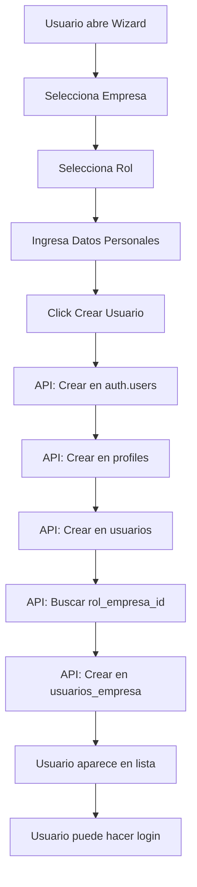

# Flujo de Creación de Usuarios desde UI

## 📋 Reglas de Negocio

### Orden Obligatorio
1. **Empresa** → Se crea primero
2. **Usuario** → Se crea después vinculado a empresa
3. **Vínculo** → Siempre existe en `usuarios_empresa`

### Regla de Oro
❌ **No puede existir usuario sin empresa**

---

## 🚀 Proceso Automatizado desde WizardUsuario

### Paso 1: Usuario completa el Wizard
El `WizardUsuario.tsx` valida:
- ✅ Empresa es obligatoria (validación línea 367)
- ✅ Rol es obligatorio (validación línea 370)
- ✅ Email es válido
- ✅ Nombre completo

### Paso 2: API `/api/admin/nueva-invitacion` crea todo automáticamente

**Flujo completo en una sola llamada:**

```typescript
1. Crear usuario en auth.users
   - Email + password temporal
   - email_confirm: true
   - user_metadata con todos los datos

2. Crear registro en profiles
   - id: user_id
   - name: nombre completo
   
3. Crear registro en usuarios
   - id: user_id
   - email: email
   - nombre_completo: nombre + apellido

4. Buscar rol_empresa_id
   - Por nombre_rol en roles_empresa
   
5. Crear vínculo en usuarios_empresa
   - user_id, empresa_id, rol_interno
   - rol_empresa_id, email_interno
   - nombre_completo, activo: true
```

### Paso 3: Usuario aparece automáticamente en la lista

La página `/admin/usuarios.tsx` muestra usuarios desde `usuarios_empresa`, así que el usuario recién creado aparece de inmediato.

---

## 🔧 Archivos Modificados

### 1. API: `pages/api/admin/nueva-invitacion.ts`
**Cambios:**
- ✅ Crea registro en `profiles` con columna `name` (no `full_name`)
- ✅ Crea registro en `usuarios` sin columnas inexistentes
- ✅ Busca `rol_empresa_id` antes de insertar en `usuarios_empresa`
- ✅ Incluye `email_interno` (campo requerido)
- ✅ Hace rollback completo si algo falla

### 2. Función SQL: `sql/create_network_functions.sql`
**Mejora en `agregar_usuario_empresa()`:**
- ✅ Sincroniza automáticamente `profiles` (ON CONFLICT DO NOTHING)
- ✅ Sincroniza automáticamente `usuarios` (ON CONFLICT DO NOTHING)
- ✅ Crea vínculo en `usuarios_empresa`

**Script de actualización:** `sql/actualizar-funcion-agregar-usuario.sql`

### 3. Wizard: `components/Admin/WizardUsuario.tsx`
**Ya funciona correctamente:**
- ✅ Valida empresa obligatoria
- ✅ Envía `nombre_rol` al API
- ✅ Muestra credenciales temporales
- ✅ Limpia estado después de éxito

---

## 📝 Scripts SQL Creados

### `sql/verificar-roles-wizard.sql`
Verifica que existan todos los roles necesarios en `roles_empresa`.

### `sql/actualizar-funcion-agregar-usuario.sql`
Actualiza la función `agregar_usuario_empresa()` para sincronizar automáticamente.

---

## ✅ Checklist de Despliegue

1. **Ejecutar en Supabase SQL Editor:**
   ```sql
   -- Actualizar función agregar_usuario_empresa
   \i sql/actualizar-funcion-agregar-usuario.sql
   ```

2. **Verificar roles existen:**
   ```sql
   \i sql/verificar-roles-wizard.sql
   ```

3. **Reiniciar servidor Next.js:**
   ```bash
   # Ctrl+C para detener
   npm run dev
   ```

4. **Probar creación de usuario:**
   - Ir a Admin → Usuarios
   - Click "Nuevo Usuario"
   - Completar wizard:
     * Seleccionar empresa
     * Seleccionar rol
     * Ingresar email y nombre
   - Click "Crear Usuario"
   - ✅ Verificar que aparece en lista
   - ✅ Verificar que puede hacer login

---

## 🧪 Prueba Manual

### Crear usuario de prueba:
1. Email: `prueba@test.com`
2. Nombre: `Usuario Prueba`
3. Empresa: Seleccionar cualquiera existente
4. Rol: Seleccionar cualquiera
5. Click "Crear Usuario"

### Verificar:
```sql
-- Debe aparecer en todas las tablas
SELECT 'auth.users' as tabla, id, email FROM auth.users WHERE email = 'prueba@test.com'
UNION ALL
SELECT 'profiles' as tabla, id::text, name FROM profiles WHERE id IN (SELECT id FROM auth.users WHERE email = 'prueba@test.com')
UNION ALL
SELECT 'usuarios' as tabla, id::text, email FROM usuarios WHERE email = 'prueba@test.com'
UNION ALL
SELECT 'usuarios_empresa' as tabla, user_id::text, email_interno FROM usuarios_empresa WHERE email_interno = 'prueba@test.com';
```

**Resultado esperado:** 4 filas (una por cada tabla)

---

## 🐛 Troubleshooting

### Usuario no aparece en lista
**Causa:** Falta vínculo en `usuarios_empresa`
**Solución:** Verificar que el API completó todos los pasos

### Error "Role not found"
**Causa:** El `nombre_rol` no existe en `roles_empresa`
**Solución:** Ejecutar `sql/verificar-roles-wizard.sql` y agregar roles faltantes

### Error "column does not exist"
**Causa:** Estructura de tabla diferente
**Solución:** Verificar estructura con:
```sql
SELECT column_name FROM information_schema.columns WHERE table_name = 'nombre_tabla';
```

---

## 📊 Resumen del Flujo



---

## 🎯 Resultado Final

**Ahora el flujo completo funciona desde la UI:**
1. ✅ Usuario crea cuenta desde Wizard
2. ✅ Sistema crea todos los registros necesarios
3. ✅ Usuario aparece inmediatamente en lista
4. ✅ Usuario puede hacer login con credenciales
5. ✅ No se requiere intervención manual en SQL

**Proceso manual (como el de Luis) ya no es necesario.**
