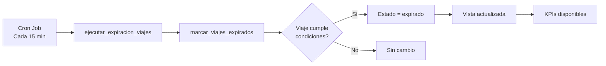

# Sistema de Estado EXPIRADO - Resumen Ejecutivo

## ✅ Implementación Completa

### 📦 Entregables

1. **Migración SQL** (`sql/migrations/013_estado_expirado_sistema.sql`)
   - Nuevo estado `expirado` en `estado_unidad_viaje`
   - Función `marcar_viajes_expirados()` - Marca viajes vencidos sin recursos
   - Función `ejecutar_expiracion_viajes()` - Wrapper para cron jobs
   - Vista `vista_viajes_expirados` - Para reportes e indicadores
   - Función `get_metricas_expiracion()` - KPIs agregados

2. **Actualización Frontend**
   - `lib/types.ts`: Tipo `EstadoUnidadViaje` incluye 'expirado'
   - `components/Planning/TrackingView.tsx`: Filtrado de viajes activos
   - Badge visual distintivo para estado expirado (rojo ⚠️)

3. **Documentación**
   - `docs/SISTEMA-ESTADO-EXPIRADO.md` - Guía completa de implementación

### 🎯 Funcionalidades Implementadas

#### ✅ Requisito 1: Viajes Expirados
**Condición**: Viaje llega a fecha/hora programada sin chofer y/o camión asignado

**Acción**: 
- Estado cambia automáticamente a `expirado`
- Queda registrado en BD para análisis

**Beneficios**:
- Trazabilidad completa
- Métricas de eficiencia operativa
- Identificación de cuellos de botella

#### ✅ Requisito 2: Filtrado en Seguimiento Tiempo Real
**Estados excluidos**:
- `expirado`
- `viaje_completado`
- `entregado`
- `cancelado`
- `descarga_completada`

**Resultado**:
- Solo viajes activos en pantalla
- Información relevante y accionable
- Menos ruido visual

#### ✅ Requisito 3: Visualización en Planificación
**Viajes expirados**:
- Aparecen con badge rojo `⚠️ Expirado`
- Tarjeta con borde rojo distintivo
- Mantienen visibilidad para registro histórico

**Viajes finalizados**:
- Excluidos de Seguimiento Tiempo Real
- Visibles en Planificación para referencia

### 📊 Estructura de Datos (Buenas Prácticas)

#### Tabla `viajes_despacho`
```sql
estado estado_unidad_viaje
  - Incluye: 'expirado' (nuevo)
  - Mantiene integridad referencial
  - Permite reportes históricos
```

#### Vista `vista_viajes_expirados`
```sql
Campos clave:
- viaje_id, despacho_id, pedido_id
- fecha_programada vs fecha_expiracion
- horas_despues_programado (para KPIs)
- razon_expiracion (diagnóstico)
- era_urgente (impacto en prioridades)
- coordinador_responsable (accountability)
```

**Ventajas**:
- ✅ Datos normalizados
- ✅ Sin duplicación
- ✅ Consultas eficientes
- ✅ Auditable y trazable

### 🔄 Proceso Automático



### 📈 Indicadores Disponibles

#### Métricas Automáticas
```sql
SELECT * FROM get_metricas_expiracion();
```

Retorna:
- **total_expirados**: Cantidad total
- **por_falta_chofer**: Sin chofer asignado
- **por_falta_camion**: Sin camión asignado
- **por_falta_ambos**: Sin ningún recurso
- **urgentes_expirados**: Viajes prioritarios afectados
- **promedio_horas_retraso**: Tiempo medio de retraso
- **tasa_expiracion_pct**: % de viajes que expiran

#### Reportes Personalizados
```sql
-- Por transporte
SELECT transporte_nombre, COUNT(*)
FROM vista_viajes_expirados
GROUP BY transporte_nombre;

-- Por día
SELECT DATE(fecha_expiracion), COUNT(*)
FROM vista_viajes_expirados
GROUP BY DATE(fecha_expiracion);

-- Urgentes
SELECT * FROM vista_viajes_expirados
WHERE era_urgente = TRUE;
```

### 🚀 Próximos Pasos para Despliegue

#### 1. Ejecutar Migración SQL ⏱️ 2 min
```bash
supabase db push sql/migrations/013_estado_expirado_sistema.sql
```

#### 2. Configurar Automatización ⏱️ 10 min
Elegir una opción:
- **A)** Supabase Edge Function + Cron (recomendado)
- **B)** pg_cron (si disponible)
- **C)** Llamada desde frontend (temporal)

Ver detalles en `docs/SISTEMA-ESTADO-EXPIRADO.md`

#### 3. Testing ⏱️ 5 min
```sql
-- Crear viaje de prueba
-- Ejecutar función manual
-- Verificar en vista
```

#### 4. Monitoring ⏱️ Continuo
```sql
-- Consulta diaria
SELECT * FROM get_metricas_expiracion(
    NOW() - INTERVAL '1 day',
    NOW()
);
```

### 🎨 Impacto Visual en UI

#### Antes
- Todos los viajes mezclados
- Difícil identificar activos vs históricos
- Viajes completados en seguimiento

#### Después
- **Seguimiento Tiempo Real**: Solo viajes activos
- **Planificación**: Expirados con badge rojo distintivo
- **Indicadores**: Métricas de eficiencia visibles

### 💡 Beneficios del Negocio

1. **Operacionales**
   - Identificación temprana de problemas
   - Reducción de ruido en seguimiento
   - Foco en viajes accionables

2. **Analíticos**
   - KPIs de eficiencia operativa
   - Identificación de transportes problemáticos
   - Tendencias de mejora/empeoramiento

3. **Accountability**
   - Registro de viajes no ejecutados
   - Trazabilidad de responsables
   - Base para mejora continua

### 📋 Checklist de Validación

- [ ] Migración SQL ejecutada sin errores
- [ ] Vista `vista_viajes_expirados` retorna datos
- [ ] Función `marcar_viajes_expirados()` ejecuta correctamente
- [ ] Cron job configurado y activo
- [ ] Frontend muestra viajes expirados con badge rojo
- [ ] Seguimiento Tiempo Real excluye viajes inactivos
- [ ] Métricas disponibles en `get_metricas_expiracion()`

### 🔗 Archivos de Referencia

| Archivo | Propósito |
|---------|-----------|
| `sql/migrations/013_estado_expirado_sistema.sql` | Migración completa |
| `docs/SISTEMA-ESTADO-EXPIRADO.md` | Guía detallada |
| `lib/types.ts` | Tipos TypeScript |
| `components/Planning/TrackingView.tsx` | Lógica de filtrado |

---

**Estado**: ✅ Listo para Producción  
**Riesgo**: 🟢 Bajo (no afecta datos existentes, totalmente reversible)  
**Tiempo estimado de deploy**: ⏱️ 20 minutos
