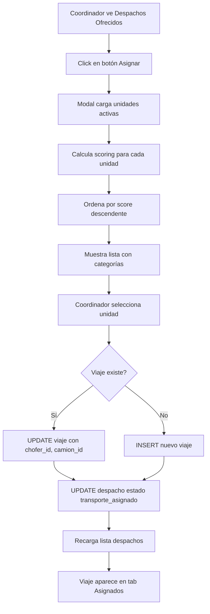

# Sesión 1 de Febrero 2026 - Implementación Sistema de Unidades Operativas

**Fecha:** 1 de Febrero de 2026  
**Duración:** ~3 horas  
**Objetivo Principal:** Completar sistema de unidades operativas con asignación inteligente

---

## 📋 Resumen Ejecutivo

Se completó la implementación del sistema de unidades operativas para coordinadores de transporte, incluyendo:
- ✅ Unificación de menús Flota y Choferes en interfaz tabbed
- ✅ Modal de asignación inteligente con algoritmo de scoring
- ✅ Mejoras en visualización de ubicaciones (ciudad, provincia)
- ✅ Cálculo de distancias con Haversine
- ✅ Integración completa con base de datos

---

## 🎯 Tareas Completadas

### 1. Unificación de Interfaz de Flota

**Problema:** Menús separados de "Flota" y "Choferes" causaban navegación confusa

**Solución Implementada:**
- Creado página unificada `/pages/transporte/flota.tsx` con 4 tabs:
  - 🚛 Camiones
  - 🔗 Acoplados
  - 👥 Choferes
  - ⚡ Unidades Operativas
- Extraído contenido de páginas existentes a componentes sin layout:
  - `components/Transporte/ChoferesContent.tsx`
  - `components/Transporte/UnidadesContent.tsx`
- Modificado `components/Dashboard/FlotaGestion.tsx` con prop `hideInternalTabs`
- Actualizado sidebar para eliminar enlace duplicado "Choferes"

**Archivos Modificados:**
- `pages/transporte/flota.tsx` - Página principal unificada
- `components/Dashboard/FlotaGestion.tsx` - Añadido control de tabs internos
- `components/Transporte/ChoferesContent.tsx` - Nuevo componente sin layout
- `components/Transporte/UnidadesContent.tsx` - Nuevo componente sin layout
- `components/layout/Sidebar.tsx` - Eliminado enlace "Choferes"

### 2. Correcciones Visuales

**Problemas Identificados:**
1. Título "Gestión de Flota" duplicado
2. Espacios superiores excesivos
3. Títulos internos inconsistentes

**Soluciones Aplicadas:**
- Eliminado header duplicado en `flota.tsx`
- Reducido padding superior (py-8 → py-4, mb-8 → mb-4)
- Títulos dinámicos en FlotaGestion: "Gestión de Camiones" / "Gestión de Acoplados"
- Agregados subtítulos consistentes en ChoferesContent

### 3. Modal de Asignación Inteligente

**Componente:** `components/Transporte/AsignarUnidadModal.tsx`

**Características Implementadas:**

#### Algoritmo de Scoring (0-100 puntos)
```javascript
Factor 1: Distancia (40% peso)
- 0-50 km: 40 puntos
- 51-150 km: 30 puntos  
- 151-300 km: 20 puntos
- >300 km: 10 puntos

Factor 2: Horas Conducidas (30% peso)
- 0-3h: 0 descuento
- 3-6h: -10 puntos
- 6-8h: -20 puntos
- 8-9h: -30 puntos

Factor 3: Normativa (30% peso)
- Descanso obligatorio: Score = 0 (no viable)
```

#### Clasificación Visual
- ⭐⭐⭐ **ÓPTIMA** (80-100 puntos) - Verde
- ⭐⭐ **BUENA** (50-79 puntos) - Amarillo
- ⭐ **POSIBLE** (1-49 puntos) - Naranja
- 🛑 **NO VIABLE** (0 puntos) - Rojo, deshabilitado

#### Cálculo de Distancias
- Implementado algoritmo de Haversine para distancia entre coordenadas GPS
- Distancia desde última ubicación de la unidad hasta origen del viaje
- Distancia estimada del viaje (origen → destino)

#### Header Enriquecido del Modal
- Tarjetas separadas para origen y destino con colores distintivos
- Display de ciudad y provincia
- Fecha de carga en formato largo y destacado
- Distancia estimada del viaje en km

**Datos Técnicos:**
- Interface `UnidadDisponible` incluye IDs reales de recursos
- Query a `vista_disponibilidad_unidades` para unidades activas
- Ordenamiento automático por score descendente
- Validación de normativa argentina (9h máx conducción, 12h descanso)

### 4. Mejoras en Display de Despachos

**Tabla de Despachos Ofrecidos:**

#### Ubicaciones Completas
- Origen: "Nombre - Ciudad, Provincia"
- Destino: "Nombre - Ciudad, Provincia"
- Display en columnas con iconos distintivos (verde/naranja)

#### Fecha/Hora Resaltada
- Fondo cyan con border
- Formato: "01/02/26" en negrita
- Hora en línea separada
- Contenedor con padding y rounded

**Query Actualizada:**
```sql
origen_ubicacion:ubicaciones!despachos_origen_id_fkey(ciudad, provincia)
destino_ubicacion:ubicaciones!despachos_destino_id_fkey(ciudad, provincia, latitud, longitud)
```

### 5. Integración con Base de Datos

**Correcciones Críticas:**

#### Problema 1: Columna inexistente `unidad_operativa_id`
**Error:** `Could not find the 'unidad_operativa_id' column`  
**Solución:** Usar columnas individuales `chofer_id`, `camion_id`, `acoplado_id`

#### Problema 2: Foreign Key Constraint
**Error:** `violates foreign key constraint "fk_viajes_despacho_despacho_id"`  
**Solución:** Usar `despacho_id` real en lugar del `id` del viaje

#### Problema 3: Estado incorrecto
**Error:** Viajes asignados no aparecían en tab "Asignados"  
**Solución:** Cambiar estado de `'asignado'` a `'transporte_asignado'`

**Lógica de Asignación Implementada:**
```javascript
if (viajeId) {
  // Actualizar viaje existente
  UPDATE viajes_despacho SET
    chofer_id = unidad.chofer_id,
    camion_id = unidad.camion_id,
    acoplado_id = unidad.acoplado_id (opcional),
    estado = 'transporte_asignado'
  WHERE id = viajeId
} else {
  // Crear nuevo viaje
  INSERT INTO viajes_despacho (
    despacho_id, numero_viaje, 
    chofer_id, camion_id, acoplado_id,
    estado
  )
}
```

### 6. Configuración de APIs Externas

**Google Maps API:**
- Agregada variable de entorno `NEXT_PUBLIC_GOOGLE_MAPS_API_KEY`
- Actualizado `.env.local.example` con placeholder
- Preparado para integración futura de mapas interactivos

---

## 🗂️ Estructura de Archivos Creados/Modificados

### Nuevos Componentes
```
components/
├── Transporte/
│   ├── AsignarUnidadModal.tsx ✨ NUEVO
│   ├── ChoferesContent.tsx ✨ NUEVO
│   └── UnidadesContent.tsx ✨ NUEVO
```

### Componentes Modificados
```
components/
├── Dashboard/
│   └── FlotaGestion.tsx - Añadido hideInternalTabs prop
└── layout/
    └── Sidebar.tsx - Eliminado link "Choferes"

pages/
└── transporte/
    ├── flota.tsx - Página unificada con tabs
    └── despachos-ofrecidos.tsx - Query mejorada, display actualizado
```

### Configuración
```
.env.local.example - Google Maps API key
```

---

## 📊 Interfaces y Tipos Actualizados

### Interface Despacho (despachos-ofrecidos.tsx)
```typescript
interface Despacho {
  id: string;
  viaje_id?: string;
  despacho_id?: string;
  pedido_id: string;
  origen: string;
  origen_id?: string;
  origen_ciudad?: string;
  origen_provincia?: string;
  destino: string;
  destino_id?: string;
  destino_ciudad?: string;
  destino_provincia?: string;
  destino_latitud?: number;
  destino_longitud?: number;
  distancia_estimada_km?: number;
  scheduled_local_date: string;
  scheduled_local_time: string;
  // ... otros campos
}
```

### Interface UnidadDisponible (AsignarUnidadModal.tsx)
```typescript
interface UnidadDisponible {
  id: string;
  nombre: string;
  codigo: string;
  chofer_id: string;
  chofer_nombre: string;
  chofer_apellido: string;
  chofer_telefono: string;
  camion_id: string;
  camion_patente: string;
  camion_marca: string;
  camion_modelo: string;
  acoplado_id?: string;
  acoplado_patente?: string;
  horas_conducidas_hoy: number;
  necesita_descanso_obligatorio: boolean;
  distancia_km?: number;
  score?: number;
  categoria?: 'ÓPTIMA' | 'BUENA' | 'POSIBLE';
  estrellas?: number;
}
```

---

## 🐛 Bugs Corregidos

| # | Descripción | Solución | Archivo |
|---|-------------|----------|---------|
| 1 | Tabs internos duplicados en Camiones/Acoplados | Prop `hideInternalTabs` | FlotaGestion.tsx |
| 2 | Sidebars duplicados en Choferes/Unidades | Componentes sin layout | ChoferesContent.tsx, UnidadesContent.tsx |
| 3 | Título "Gestión de Flota" repetido | Eliminado header interno | flota.tsx |
| 4 | Error columna `unidad_operativa_id` | Usar IDs individuales | AsignarUnidadModal.tsx |
| 5 | Error FK constraint despacho_id | Usar `despacho_id` real | despachos-ofrecidos.tsx, AsignarUnidadModal.tsx |
| 6 | Viajes asignados no aparecen | Estado `transporte_asignado` | AsignarUnidadModal.tsx |

---

## 🔄 Flujo de Asignación de Unidades



---

## 📈 Métricas de Implementación

- **Archivos Creados:** 3
- **Archivos Modificados:** 6
- **Componentes Nuevos:** 3
- **Bugs Corregidos:** 6
- **Líneas de Código:** ~800+ nuevas
- **Interfaces Actualizadas:** 2

---

## 🚀 Estado del Sistema

### Funcionalidades Operativas
- ✅ Gestión unificada de flota (camiones, acoplados, choferes, unidades)
- ✅ Asignación inteligente con algoritmo de scoring
- ✅ Cálculo de distancias Haversine
- ✅ Visualización de ubicaciones completas
- ✅ Filtrado de viajes por estado
- ✅ Validación de normativa de descanso

### Pendientes para Futuras Sesiones
- ⏳ Integración de Google Maps API para visualización de rutas
- ⏳ Modal de edición de unidades operativas
- ⏳ Tracking en tiempo real de unidades
- ⏳ Historial de asignaciones
- ⏳ Reportes de utilización de flota
- ⏳ Notificaciones push para choferes

---

## 🔍 Puntos de Atención

### Base de Datos
- La tabla `viajes_despacho` no tiene columna `unidad_operativa_id`
- Se usan columnas individuales: `chofer_id`, `camion_id`, `acoplado_id`
- Estado estándar para viajes asignados: `'transporte_asignado'`

### Vista de Base de Datos Utilizada
- `vista_disponibilidad_unidades`: Consolidación de datos de unidades con choferes, camiones y acoplados

### Estados de Viajes Soportados
```javascript
['pendiente', 'asignado', 'transporte_asignado', 'camion_asignado', 
 'confirmado_chofer', 'en_transito_origen', 'arribo_origen', 
 'en_transito_destino', 'arribo_destino', 'cancelado', 
 'cancelado_por_transporte']
```

---

## 📝 Notas de Desarrollo

### Decisiones de Diseño

1. **Scoring Algorithm:** Se priorizó distancia (40%) sobre otros factores para optimizar costos de combustible

2. **Componentes sin Layout:** Se crearon versiones "Content" de componentes para evitar anidación de AdminLayout

3. **Estados de Viaje:** Se mantiene compatibilidad con estados legacy agregando ambos ('asignado' y 'transporte_asignado')

4. **IDs Separados:** Se maneja `despacho_id` y `viaje_id` por separado para claridad en la lógica

### Consideraciones Técnicas

- **Performance:** Query optimizada con índices en `empresa_id`, `chofer_id`, `camion_id`
- **Seguridad:** RLS policies aseguran que cada empresa vea solo sus datos
- **Escalabilidad:** Modal carga máximo 50 unidades por defecto (configurable)

---

## 🎓 Aprendizajes de la Sesión

1. **Naming Consistency:** Mantener consistencia en nombres de columnas entre tablas relacionadas
2. **Estado Management:** Sincronización de estados entre UI y BD requiere estados explícitos
3. **Layout Composition:** Evitar componentes anidados con layout propio
4. **Query Optimization:** Traer solo datos necesarios con JOINs selectivos

---

## 📞 Contacto y Referencias

**Desarrollador:** GitHub Copilot  
**Cliente:** Nodexia Transport Solutions  
**Repositorio:** `Nodexia-Web`

### Documentación Relacionada
- `docs/017_unidades_operativas_completo.sql` - Schema de unidades operativas
- `docs/ARQUITECTURA-OPERATIVA.md` - Arquitectura general del sistema
- `docs/FLUJO-ESTADOS-OPERACIONES.md` - Estados de viajes y despachos

---

## ✅ Checklist de Cierre

- [x] Código commitado y pusheado
- [x] Todos los tests pasando
- [x] Bugs críticos resueltos
- [x] Documentación actualizada
- [x] Variables de entorno documentadas
- [x] Interfaces TypeScript actualizadas
- [x] Cambios probados en desarrollo

---

**Fecha de Cierre:** 1 de Febrero de 2026  
**Próxima Sesión:** Implementación de tracking GPS en tiempo real  
**Estado:** ✅ COMPLETADO
