# Estado Actual del Sistema - 9 de Diciembre 2025

## 📊 Resumen Ejecutivo

### Sistema: Nodexia - Plataforma de Gestión de Transporte de Cargas
**Stack Tecnológico:** Next.js 15.5.6, React 19, TypeScript, Supabase (PostgreSQL), TailwindCSS  
**Estado:** Desarrollo Activo - Fase de Integración Red Nodexia  
**Última Sesión:** 9 de Diciembre 2025

---

## 🎯 Avances de la Sesión Actual

### 1. **Integración Red Nodexia con Flujo Directo** ✅ COMPLETADO

#### Problema Resuelto
Los viajes asignados desde Red Nodexia no se integraban con el flujo operativo normal. El coordinador no podía ver el despacho como "asignado" y el transporte no veía el viaje en su panel para asignar recursos.

#### Solución Implementada

**A) Lógica de Aceptación de Oferta** (`pages/crear-despacho.tsx`)
```typescript
// Al aceptar oferta desde Red Nodexia:
// 1. Obtiene viaje_id desde viajes_red_nodexia
// 2. Obtiene despacho_id desde viajes_despacho
// 3. Actualiza ofertas (aceptada/rechazadas)
// 4. Actualiza viajes_red_nodexia (estado='asignado')
// 5. ⭐ Actualiza viajes_despacho:
//    - id_transporte = UUID
//    - estado = 'transporte_asignado'
// 6. ⭐ Actualiza despachos:
//    - transport_id = integer
//    - estado = 'asignado'
```

**B) Modal de Confirmación Elegante** (`components/Transporte/VerEstadoRedNodexiaModal.tsx`)
- Reemplazó `window.confirm` y `alert` por modal personalizado
- Loading state con "Procesando..." durante ejecución
- Previene clicks múltiples con disabled state
- Promesas async/await para garantizar orden de ejecución

**C) Vista del Transporte** (`pages/transporte/despachos-ofrecidos.tsx`)
- Query incluye viajes con `estado='transporte_asignado'`
- Viajes de Red Nodexia aparecen inmediatamente después de aceptación
- Badge visual 🌐 preparado (pendiente de campo `origen_asignacion` en BD)

#### Archivos Modificados
1. `pages/crear-despacho.tsx` - Líneas ~717-840
2. `components/Transporte/VerEstadoRedNodexiaModal.tsx` - Completo
3. `pages/transporte/despachos-ofrecidos.tsx` - Query y mapeo
4. `sql/migrations/007_agregar_origen_asignacion.sql` - Creado (pendiente ejecución)
5. `pages/api/migrations/agregar-origen-asignacion.ts` - Endpoint de migración
6. `docs/INTEGRACION-RED-NODEXIA-FLUJO-DIRECTO.md` - Documentación técnica

---

## ⚠️ Tareas Pendientes Críticas

### 1. **Ejecutar Migración de Base de Datos** 🔴 URGENTE
**Archivo:** `sql/migrations/007_agregar_origen_asignacion.sql`

**Columnas a agregar:**
```sql
-- En tabla despachos
ALTER TABLE despachos 
ADD COLUMN origen_asignacion VARCHAR(20) DEFAULT 'directo' 
CHECK (origen_asignacion IN ('directo', 'red_nodexia'));

-- En tabla viajes_despacho  
ALTER TABLE viajes_despacho 
ADD COLUMN origen_asignacion VARCHAR(20) DEFAULT 'directo'
CHECK (origen_asignacion IN ('directo', 'red_nodexia'));
```

**Cómo ejecutar:**
- Opción A: `psql` con credenciales de Supabase
- Opción B: POST a `/api/migrations/agregar-origen-asignacion`
- Opción C: SQL Editor de Supabase Dashboard

**Después de migración, descomentar en código:**
1. `pages/crear-despacho.tsx` líneas ~803, ~813 (agregar origen_asignacion)
2. `pages/transporte/despachos-ofrecidos.tsx` línea ~228 (mostrar campo)
3. Badge 🌐 se activará automáticamente

### 2. **Testing del Flujo Completo** 🟡 SIGUIENTE
**Escenario de prueba:**
```
1. Perfil: Coordinador Planta (Aceitera San Miguel)
   - Crear despacho
   - Abrir en Red Nodexia
   - Ver ofertas recibidas
   - Aceptar oferta de "Transportes Regional Demo"
   - Verificar: Despacho aparece en tab "Asignados"

2. Perfil: Transporte (Transportes Regional Demo)  
   - Ver viaje en "Despachos Ofrecidos"
   - Asignar chofer
   - Asignar camión
   - Verificar: Estados cambian correctamente

3. Flujo Operativo Normal
   - Chofer confirma viaje
   - GPS tracking
   - Control de acceso planta
   - Carga/descarga
   - Finalización
   - Verificar: TODO funciona igual que viaje directo
```

---

## 🏗️ Arquitectura del Sistema

### Entidades Principales

#### 1. **Empresas** (Multi-tenant)
```typescript
empresas {
  id: UUID
  nombre: string
  tipo_empresa: 'planta' | 'cliente' | 'transporte'
  cuit: string
  // Relaciones:
  // - usuarios via usuarios_empresas
  // - transportes via tabla transportes
}
```

#### 2. **Red Nodexia** (Marketplace de Cargas)
```typescript
viajes_red_nodexia {
  id: UUID
  viaje_id: UUID → viajes_despacho.id
  empresa_solicitante_id: UUID → empresas.id
  tarifa_ofrecida: decimal
  estado_red: 'abierto' | 'con_ofertas' | 'asignado' | 'cerrado'
  transporte_asignado_id: UUID → empresas.id
  oferta_aceptada_id: UUID → ofertas_red_nodexia.id
}

ofertas_red_nodexia {
  id: UUID
  viaje_red_id: UUID → viajes_red_nodexia.id
  transporte_id: UUID → empresas.id
  estado_oferta: 'pendiente' | 'aceptada' | 'rechazada'
  fecha_oferta: timestamp
  fecha_respuesta: timestamp
}

requisitos_viaje_red {
  viaje_red_id: UUID
  tipo_camion: string
  requiere_gps: boolean
  requiere_carga_peligrosa: boolean
  // ... otros requisitos
}
```

#### 3. **Despachos y Viajes**
```typescript
despachos {
  id: UUID
  pedido_id: string
  origen: string
  destino: string
  estado: 'pendiente' | 'asignado' | 'en_proceso' | 'completado'
  transport_id: integer → transportes.id (legacy)
  cantidad_viajes_solicitados: integer
  // Pendiente: origen_asignacion: 'directo' | 'red_nodexia'
}

viajes_despacho {
  id: UUID
  despacho_id: UUID → despachos.id
  numero_viaje: integer
  id_transporte: UUID → empresas.id
  estado: 'pendiente' | 'transporte_asignado' | 'camion_asignado' | 
          'confirmado' | 'en_transito' | 'completado'
  id_chofer: UUID → choferes.id
  id_camion: UUID → camiones.id
  // Pendiente: origen_asignacion: 'directo' | 'red_nodexia'
}
```

### Flujos Principales

#### A) **Asignación Directa** (Tradicional)
```
Coordinador crea despacho
  ↓
Asigna transporte vinculado
  ↓
despachos.transport_id = X
viajes_despacho.id_transporte = UUID
  ↓
Transporte asigna recursos
  ↓
Flujo operativo normal
```

#### B) **Asignación Red Nodexia** (Marketplace)
```
Coordinador crea despacho
  ↓
"Abrir en Red Nodexia"
  ↓
viajes_red_nodexia.estado_red = 'abierto'
  ↓
Transportes NO vinculados ven oferta
  ↓
Transporte envía oferta
  ↓
ofertas_red_nodexia.estado_oferta = 'pendiente'
  ↓
Coordinador acepta oferta ⭐
  ↓
┌─────────────────────────────────────┐
│ 1. viajes_red_nodexia               │
│    estado_red = 'asignado'          │
├─────────────────────────────────────┤
│ 2. viajes_despacho                  │
│    id_transporte = UUID             │
│    estado = 'transporte_asignado'   │
├─────────────────────────────────────┤
│ 3. despachos                        │
│    transport_id = integer           │
│    estado = 'asignado'              │
└─────────────────────────────────────┘
  ↓
⭐ DESDE AQUÍ: MISMO FLUJO QUE DIRECTO
  ↓
Transporte asigna chofer/camión
  ↓
Operación normal hasta completado
```

---

## 🔑 Credenciales y Accesos

### Supabase
- **URL:** `https://lkdcodfzfnltuzrewolr.supabase.co`
- **Project:** krzf-dealazatwhej
- **Pooler:** aws-0-us-west-1.pooler.supabase.com:6543
- **Password:** Leandro05*

### Usuarios de Prueba
**Coordinador Planta - Aceitera San Miguel:**
- Email: martin@regional.com
- Empresa: Aceitera San Miguel S.A
- Rol: coordinador_transporte

**Transporte Red Nodexia:**
- Email: (usuario de Transportes Regional Demo)
- Empresa: Transportes Regional Demo
- CUIT: 20-30000010-0
- Sin vínculo con Aceitera San Miguel

---

## 📁 Estructura de Archivos Clave

### Frontend Pages
```
pages/
├── crear-despacho.tsx          # Coordinador crea despachos
│   └── handleAceptarOfertaDesdeModal() - MODIFICADO
├── transporte/
│   ├── despachos-ofrecidos.tsx # Transporte ve viajes asignados
│   ├── cargas-en-red.tsx       # Transporte ve ofertas Red
│   └── viajes-activos.tsx      # Tracking GPS en tiempo real
└── red-nodexia/
    └── ofertas.tsx             # Admin Red ve todas las ofertas
```

### Components
```
components/
├── Transporte/
│   ├── VerEstadoRedNodexiaModal.tsx  # Modal ofertas - MODIFICADO
│   └── AbrirRedNodexiaModal.tsx      # Publicar en Red
└── Modals/
    └── AssignTransportModal.tsx       # Asignación directa
```

### Hooks
```
lib/hooks/
└── useRedNodexia.tsx           # Lógica de Red Nodexia
    ├── obtenerViajesAbiertos()
    ├── crearOferta()
    ├── obtenerOfertasViaje()
    └── aceptarOferta()
```

### SQL
```
sql/
├── red-nodexia-schema.sql              # Schema completo Red
├── create-viajes-despacho-system.sql   # Sistema de viajes
└── migrations/
    └── 007_agregar_origen_asignacion.sql  # 🔴 PENDIENTE
```

---

## 🐛 Problemas Conocidos y Soluciones

### 1. Modal se reabre después de confirmar ✅ RESUELTO
**Causa:** Función `onAceptarOferta` no era async y modal se cerraba antes de completar  
**Solución:** Cambió a `Promise<void>`, agregado loading state

### 2. Error "origen_asignacion column does not exist" ⚠️ PENDIENTE
**Causa:** Migración de BD no ejecutada  
**Solución:** Ejecutar `007_agregar_origen_asignacion.sql`  
**Workaround actual:** Campo comentado en código

### 3. transport_id vs id_transporte 🟡 ADVERTENCIA
**Contexto:** Hay inconsistencia en nombres de columnas
- `despachos.transport_id` = integer (FK a tabla transportes legacy)
- `viajes_despacho.id_transporte` = UUID (FK a tabla empresas)
**Solución actual:** Código maneja ambos casos

### 4. Diferencia entre transportes y empresas tipo transporte
**Contexto:** 
- Tabla `transportes` (legacy): integer IDs, 1:1 con empresa
- Tabla `empresas` tipo='transporte': UUID, arquitectura nueva
**Impacto:** Conversiones necesarias en queries
**Estado:** Funcionando correctamente

---

## 🎨 UI/UX Implementado

### Badges y Estados
```typescript
// Estados de Red Nodexia
"EN RED" - Badge amarillo (viaje publicado)
"Ver Estado" - Botón azul (ver ofertas)
🌐 "Red" - Badge cyan (origen Red Nodexia) - PENDIENTE MIGRACIÓN

// Estados de viajes
"Pendiente" - Naranja
"Transporte Asignado" - Amarillo  
"Camión Asignado" - Verde
"En Tránsito" - Azul
"Completado" - Verde brillante
```

### Modales
1. **AbrirRedNodexiaModal**: Publicar viaje en Red
2. **VerEstadoRedNodexiaModal**: Ver ofertas recibidas + Confirmar
3. **AssignTransportModal**: Asignación directa tradicional

---

## 📊 Métricas y Reportes (Preparado)

### Queries de Análisis (Cuando origen_asignacion esté disponible)

```sql
-- Comparativa Red vs Directo
SELECT 
  origen_asignacion,
  COUNT(*) as total_viajes,
  AVG(EXTRACT(EPOCH FROM (fecha_confirmacion_entrega - fecha_creacion))/3600) as horas_promedio,
  COUNT(CASE WHEN estado = 'completado' THEN 1 END)::float / COUNT(*) as tasa_completados
FROM viajes_despacho
WHERE fecha_creacion >= CURRENT_DATE - INTERVAL '30 days'
GROUP BY origen_asignacion;

-- Top transportes de Red Nodexia
SELECT 
  e.nombre as transporte,
  COUNT(vd.id) as viajes_totales,
  COUNT(CASE WHEN vd.estado = 'completado' THEN 1 END) as completados,
  AVG(COALESCE(e.calificacion_promedio, 0)) as rating
FROM viajes_despacho vd
JOIN empresas e ON e.id = vd.id_transporte
WHERE vd.origen_asignacion = 'red_nodexia'
GROUP BY e.id, e.nombre
ORDER BY viajes_totales DESC;
```

---

## 🔄 Estados del Sistema

### Ciclo de Vida de un Viaje en Red

```mermaid
graph LR
    A[Coordinador crea despacho] --> B[Abre en Red]
    B --> C[estado_red: abierto]
    C --> D[Transportes ven oferta]
    D --> E[Transporte envía oferta]
    E --> F[estado_oferta: pendiente]
    F --> G[Coordinador acepta]
    G --> H[estado_red: asignado]
    H --> I[viaje_despacho.estado: transporte_asignado]
    I --> J[Transporte asigna recursos]
    J --> K[Flujo normal: confirmado → transito → completado]
```



### RLS Policies Importantes
```sql
-- Solo transportes sin vínculo ven viajes en Red
CREATE POLICY "Solo transportes sin vinculo ven viajes"
ON viajes_red_nodexia
FOR SELECT
TO authenticated
USING (
  NOT EXISTS (
    SELECT 1 FROM relaciones_empresas re
    WHERE re.empresa_transporte_id = auth.uid_empresa()
    AND re.empresa_cliente_id = viajes_red_nodexia.empresa_solicitante_id
  )
);
```

---

## 🚀 Próximos Pasos Recomendados

### Prioridad 1: Testing Completo
1. ✅ Ejecutar migración de BD
2. ✅ Descomentar código de origen_asignacion
3. ✅ Probar flujo coordinador → transporte
4. ✅ Verificar badge 🌐 aparece
5. ✅ Validar operación completa hasta viaje completado

### Prioridad 2: Optimizaciones
1. Notificaciones push al transporte cuando se acepta oferta
2. Email de confirmación con detalles del viaje
3. Dashboard de métricas Red vs Directo
4. Sugerencias de tarifa competitiva basadas en histórico

### Prioridad 3: Features Avanzados
1. Matching automático por ubicación y requisitos
2. Sistema de scoring de transportes
3. Predicción de disponibilidad
4. Reportes de rentabilidad por origen

---

## 📞 Contactos y Referencias

### Documentación Creada
- `docs/INTEGRACION-RED-NODEXIA-FLUJO-DIRECTO.md` - Guía técnica completa
- `sql/migrations/007_agregar_origen_asignacion.sql` - Script de migración
- `CORRECCIONES-VIAJES-ACTIVOS-27-NOV.md` - Correcciones previas

### Enlaces Útiles
- Supabase Dashboard: https://supabase.com/dashboard/project/krzf-dealazatwhej
- Repositorio: Nodexia-Web (Danium77)
- Branch: main

---

## 🔍 Debugging Tips

### Logs Clave
```typescript
console.log('🎯 Aceptando oferta:', { ofertaId, transporteId, viajeRedId });
console.log('📦 Viaje en red encontrado:', viajeRed);
console.log('🚛 Viaje despacho encontrado:', viajeDespacho);
console.log('✅ Asignación completada exitosamente');
```

### Queries de Validación
```sql
-- Ver estado de viaje en Red
SELECT 
  vrn.id,
  vrn.estado_red,
  vrn.transporte_asignado_id,
  vd.estado as estado_viaje,
  d.estado as estado_despacho,
  e.nombre as transporte_nombre
FROM viajes_red_nodexia vrn
JOIN viajes_despacho vd ON vd.id = vrn.viaje_id
JOIN despachos d ON d.id = vd.despacho_id
LEFT JOIN empresas e ON e.id = vrn.transporte_asignado_id
WHERE vrn.id = 'UUID_DEL_VIAJE';
```

### Errores Comunes
1. "Could not find column origen_asignacion" → Ejecutar migración
2. "Modal se reabre" → Verificar promesa async en onAceptarOferta
3. "Transport_id is null" → Verificar empresa tiene registro en tabla transportes

---

## ✅ Checklist de Continuidad

Antes de continuar en próxima sesión:

- [ ] Migración 007 ejecutada y verificada
- [ ] Código de origen_asignacion descomentado
- [ ] Testing básico completado
- [ ] Badge 🌐 funcionando
- [ ] Sin errores en consola del browser
- [ ] Despachos aparecen en tabs correctos
- [ ] Transportes ven viajes asignados

---

**Última actualización:** 9 de Diciembre 2025, 21:00 ART  
**Estado del servidor:** Ejecutando en puerto 3001 (3000 ocupado)  
**Próxima sesión:** Testing y validación completa
